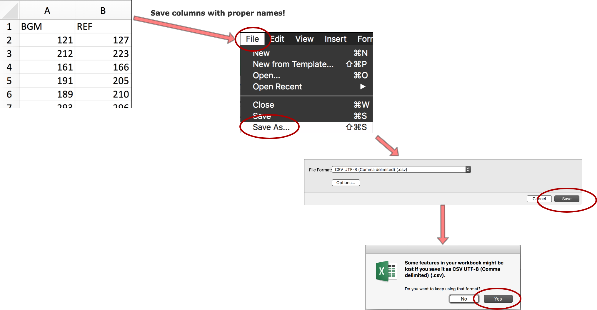
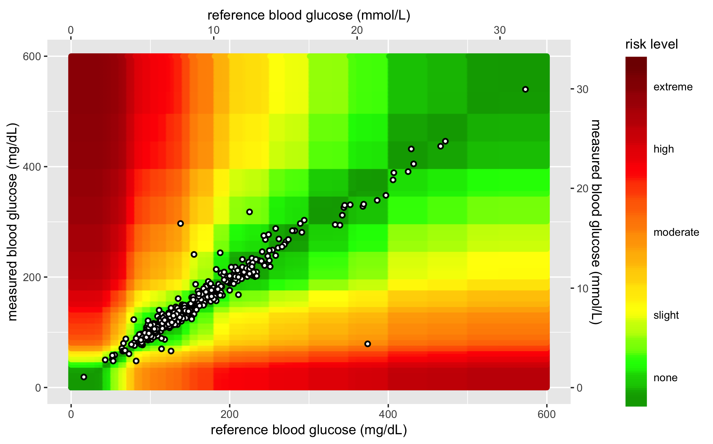
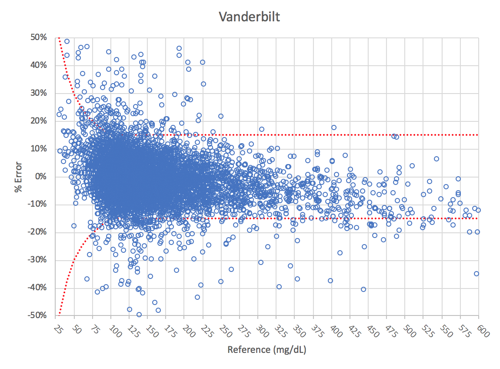

```{r setup, include=FALSE}
require(tidyverse)
require(mosaic)
require(magrittr)
library(knitr)
library(rmdformats)
## Global options
options(max.print = "75")
knitr::opts_chunk$set(
  size = "small",
  cache = FALSE,
  prompt = FALSE,
  tidy = FALSE,
  comment = NA,
  message = TRUE,
  warning = TRUE,
  error = FALSE
)
opts_knit$set(width = 75)
library(dplyr) # Data wrangling, glimpse(50) and tbl_df().
library(ggplot2) # Visualise data.
library(lubridate) # Dates and time.
library(readr) # Efficient reading of CSV data.
library(stringr) # String operations.
library(tibble) # Convert row names into a column.
library(tidyr) # Prepare a tidy dataset, gather().
library(magrittr) # Pipes %>%, %T>% and equals(), extract().
library(tidyverse) # all tidyverse packages
library(mosaic) # favstats and other summary functions
library(fs) # file management functions
library(shiny) # apps
library(datapasta) # for pasting tibbles
```

**HEADER:**  

* **Created date:** `r Sys.Date()`    
* **R version:** `r R.version.string`  

***

# Objective

Provide the background documentation and code for the Shiny SEG app. This is currently version 1.3. 

## News for Version 1.3!!

Major changes to this version include:

- replaced `heatmap` with `SEG`

- added support email


## To do 

- fix PDF download

- reorder the summary table

***

## 0.1 - Instructions table tab

This text is included on the instructions tab:

> *"Upload your data in a comma separated variables (CSV) file by clicking on the 'Browse' button in the left sidebar panel. Please refer to the image below. Your CSV file should contain only two columns. The blood glucose monitor (BGM) readings should be in the leftmost column under the heading 'BGM'. These are the meter readings or point-of-care readings. The reference values should be in the next column under the label 'REF'. Reference values might come from simultaneously obtained plasma specimens run on a laboratory analyzer such as the YSI Life Sciences 2300 Stat Plus Glucose Lactate Analyzer. If you have any questions about how your CSV data file should look before uploading it, please download the sample data set we have provided.*"



> *After you have uploaded your .csv file, click on the Create Summary Tables and the Create SEG Tables button in the left-hand panel. The results can be viewed on the 'Summary Tables' tab.*

> *When your .csv file finishes uploading, a static heatmap will be generated from the BGM and REF values. You may customize your static heatmap parameters in the left sidebar panel and download the heatmap to your computer (as either a .png or .pdf). See the example provided below:*



***

## 0.2 - Summary tables tab

These tables are from the Vanderbilt excel file `VanderbiltWithMetabolic-2018-06-11.xlsx`. The first is the summary pair type table. 

> The Surveillance Error Grid Analysis Tool Output:
> BGM = Blood Glucose Monitor
> REF = Reference
> This contains the number of BGM values that were 1) less than the REF values, 2) equal to the REF values, and 3) greater than the REF values. Note that REF values < 21 mg/dL or >600 mg/dL will not be plotted on the SEG heatmap. This tab also stratifies the values across eight clinical risk levels.

```{r PairType}
PairType <- tibble::tribble(
                                    ~Pair.Type, ~Count,
           "REF <21: Included in SEG Analysis",     3L,
       "REF > 600: Excluded from SEG Analysis",    23L,
                                       "Total",  9891L,
                                   "BGM < REF",  4710L,
                                   "BGM = REF",   479L,
                                   "BGM > REF",  4702L,
              "Total included in SEG Analysis",  9868L)
PairType
```


> Bias: Mean relative difference between BGM and REF ( BGM-REF )/ REF

> MARD: Mean Absolute Relative Difference. | BGM-REF | / REF

> CV: Standard Deviation of Relative Difference between BGM and REF

> Lower 95% Limit of Agreement: Bias - 1.96 x CV

> Upper 95% Limit of Agreement: Bias +1.96 x CV


```{r MARDTable2}
MARDTable2 <- tibble::tribble(
       ~Total,   ~Bias,   ~MARD,      ~CV, ~Lower.95..Limit.of.Agreement, ~Upper.95..Limit.of.Agreement,
        9868L, "0.60%", "7.00%", "14.80%",                     "-28.30%",                      "29.60%")
MARDTable2
```

* The new risk grades were created in the following table. 

```{r NewRiskGrades}
NewRiskGrades <- tibble::tribble(
       ~ID, ~Risk.Grade,    ~N, ~Percent,          ~REF,
        1L,         "A", 9474L, "96.00%",     "0 - 0.5",
        2L,         "B",  294L,  "3.00%", "> 0.5 - 1.0",
        3L,         "C",   79L,  "0.80%", "> 1.0 - 2.0",
        4L,         "D",   21L,  "0.20%", "> 2.0 - 3.0",
        5L,         "E",    0L,  "0.00%",       "> 3.0")
```

These are colored using the following formats. 

```{r NewRiskGrades_color, results='hide', eval=FALSE}
NewRiskGrades %>%
    DT::datatable(.,options = list(lengthChange = FALSE, 
                             dom = 't', 
                             rownames = TRUE )) %>%
      # select numerical reference
      DT::formatStyle('ID', # column
                  target = "row", # reference rows
                  backgroundColor =
      DT::styleEqual(levels =  # five levels/labels
                    c(1, 2, 3, 4, 5),
                    values = c("limegreen", 
                               "greenyellow",
                                "yellow", 
                                "orange",
                                "red")))
```


* The following risk category table (`SEGRiskCategoryTable4`) was produced:

```{r SEGRiskCategoryTable4}
SEGRiskCategoryTable4 <- tibble::tribble(
                                      ~ROW,           ~SEG.Risk.Category, ~Number.of.Pairs, ~Percent.Of.Pairs, ~Risk.Factor.Range,
                                       0,              "None 0 - 0.5*",            9474L,          "96.00%",        "0.0 - 0.5",
                                       1,  "Slight, Lower > 0.5 - 1.0",             294L,           "3.00%",       ">0.5 - 1.0",
                                       2,  "Slight, Higher >1.0 - 1.5",              55L,           "0.60%",       ">1.0 - 1.5",
                                       3,   "Moderate, Lower >1.5-2.0",              24L,           "0.20%",       ">1.5 - 2.0",
                                       4, "Moderate Higher, >2.0- 2.5",              11L,           "0.10%",       ">2.0 - 2.5",
                                       5,    "Severe, Lower > 2.5-3.0",              10L,           "0.10%",       ">2.5 - 3.0",
                                       6,    "Severe, Higher <3.0-3.5",               0L,           "0.00%",       ">3.0 - 3.5",
                                       7,               "Extreme> 3.5",               0L,           "0.00%",            "> 3.5")
SEGRiskCategoryTable4
```

These colors were added the larger risk category table in version 1.3

```{r SEGRiskCategoryTable4_color, results='hide', eval=FALSE}
library(DT)
SEGRiskCategoryTable4 %>%
  datatable(.,options = list(lengthChange = FALSE, 
                             dom = 't', 
                             rownames = FALSE )) %>%
    # select numerical reference
        formatStyle('ROW',
                  target = "row",
                  backgroundColor = styleEqual(
                      levels =  # eight levels/labels
                            c(0, 1, 2, 3,
                                4, 5, 6, 7),
                        values = c("#00EE00", "#ADFF2F", "#FFFF00",
                                   "#FFD700", "#FFA500","#EE7600",
                                   "#FF4500", "#FF0000")))
```


* The following text was added under this table:

> "Models indicate that a device with >= 97% pairs inside the SEG no-risk 'green' zone would meet the requirements of ≤ 5% data pairs outside the 15 mg/dL (0.83 mmol/L) / 15% standard limits, while higher percentages outside the SEG no-risk zone would indicate noncompliance with the standard. The Diabetes Technology Society Blood Glucose Monitor System (BGMS) Surveillance Program confirmed these ranges on 18 blood glucose monitoring systems using pre-determined analytical accuracy criteria agreed upon by the DTS-BGMS Surveillance Committee."
> Source: *J Diabetes Sci Technol 8: 673-684, 2014. PMID: 25562887.*

 

```{r ISORanges}
# datapasta::tribble_paste()
ISORanges <- tibble::tribble(
                ~ISO.Range,    ~N,  ~Percent,
         "< 5% or 5 mg/dL", 5328L,  "54.00%",
         "5-<10% or mg/dL", 2842L,  "28.80%",
        "10-<15% or mg/dL", 1050L,  "10.60%",
 "\"> 15 - 20% or mg/dL\"",  648L,   "6.60%",
      "Total", 9868L, "100.00%")
ISORanges
```

* This text was added beneath this table for clarity:

> *ISO range = difference between BGM and REF as percent of REF for REF > 100 mg/dL and in mg/dL for REF <= 100 mg/dL.*

* The binomial test table (`BinomialTable`) was rebuilt using `qbinom()` and `tibble::as_tibble()`. This is the final table on the `Summary Tables` tab. 

```{r BinomialTable}
BinomialTable <- tibble::tribble(
~Compliant.Pairs, ~Compliant.Pairs., ~Lower.Bound.for.Acceptance, ~Lower.Bound.for.Acceptance, ~Result,
        9220L,        "93.4%",   9339,       "94.6%",       "9220 < 9339 - Does not meet BGM Surveillance Study Accuracy Standard")
BinomialTable
```

* the citation was added following this table: 

> *Klonoff, D. C., et al. 'Investigation of the Accuracy of 18 Marketed Blood Glucose Monitors.' Diabetes Care. June 13, 2018. Epub ahead of print.*

***

## Load custom functions

These are some custom functions for viewing and summarizing these data. 

```{r my_r_funs_v1.4.R}
# writeLines(fs::dir_ls("Code"))
source("Code/my_r_funs_v1.4.R", echo = TRUE)
```


# PART 1 - Download data inputs

There are three data sets that need to be loaded from Github. The following code goes into the `Code/helpers.R` file:

### 1.0 upload `AppRiskPairData.csv` from github

This uploads a wrangled data set into the app for risk pairs. These data are ready to be mapped into the app and used to plot with the new data points. 

```{r RiskPairData}
# define the root github raw
github_root <- "https://raw.githubusercontent.com/"
# 1.0 upload AppRiskPairData.csv from github  ---- ---- ---- ----
app_riskpair_repo <- "mjfrigaard/SEG_shiny/master/Data/AppRiskPairData.csv"
RiskPairData <- read_csv(paste0(github_root, app_riskpair_repo))
RiskPairData %>% dplyr::glimpse(78)
# this is what the data frame should look like:
# Observations: 361201
# Variables: 5
# $ RiskPairID <int> ...
# $ REF        <int> ...
# $ BGM        <int> ...
# $ RiskFactor <dbl> ...
# $ abs_risk   <dbl> ...
```

### 1.1 load the `AppLookUpRiskCat.csv` from github

This uploads a wrangled data set into the app for a look-up table. To see what wrangling steps had to be taken, consult the `Errata` section below. 

```{r LookUpRiskCat}
# 1.1 load the AppLookUpRiskCat.csv from github  ---- ---- ---- ---- ----
app_lookup_repo <- "mjfrigaard/SEG_shiny/master/Data/AppLookUpRiskCat.csv"
LookUpRiskCat <- read_csv(paste0(github_root, app_lookup_repo))
LookUpRiskCat %>% dplyr::glimpse(78)
# this is what the data frame should look like:
# Observations: 8
# Variables: 3
# $ risk_cat <int> 0, 1, 2,...
# $ ABSLB    <dbl> -0.001, ...
# $ ABSUB    <dbl> 0.5, 1.0...
```


### 1.2 import `FullSampleData.csv` data set from github

This loads the full sample data file from Vanderbilt. There are 7857 observations in this file, and only two variables. Each data set should be loaded into the app using the guide provided on the first tab. 

```{r SampleData}
# 1.20 import full sample data set from github ---- ---- ---- ---- ----
full_sample_repo <- "mjfrigaard/SEG_shiny/master/Data/FullSampleData.csv"
SampleData <- read_csv(paste0(github_root, full_sample_repo))
SampleData %>% dplyr::glimpse(78)
# Observations: 7857
# Variables: 2
```

### 1.3 export sample data set (`AppTestData`)

Now export the test data to the `app_data` folder. There are `3000` observations in this data frame. This will get loaded to Github in the data repository here:

- https://github.com/mjfrigaard/SEG_shiny/tree/master/Data

```{r AppTestData}
app_data_path <- "Data/app_data/"
# 1.4.1 create test data frame to export ----
AppTestData <- SampleData %>% sample_n(., size = 3000)
write_csv(as_data_frame(AppTestData), path = paste0(
  app_data_path,
  "AppTestData",
  timeStamper(),
  ".csv"
))
# verify
# writeLines(fs::dir_ls(app_data_path))
```

### 1.4 Remove `AppTestData`/`SampleData` to avoid confusion!

Now remove these last two data sets to avoid any confusion in the future app development. 

```{r remove_SampleData_AppTestData}
rm(SampleData, AppTestData)
ls()
```


# PART 2 - Prepare an example uploaded data file

We can assume from this point forward that `SampMeasData` is an imported data frame the user will upload. All changes to this data frame will need to be done as a 'reactive expression', meaning the input will change every time a new data set it uploaded. 

To start with, we will upload the complete data we will use to make sure the wrangling/calculations are correct. The first step is to name the entire `VanderbiltComplete.csv` data set `SampMeasData`.

```{r VandComp}
# 1.6.1 load the vanderbilt data set ---- ---- ---- ----
# writeLines(fs::dir_ls(app_data_path))
vanderbilt_repo <- "mjfrigaard/SEG_shiny/master/Data/VanderbiltComplete.csv"
SampMeasData <- read_csv(paste0(github_root, vanderbilt_repo))
SampMeasData %>% dplyr::glimpse(78)
# Observations: 9891
# Variables: 2
```

All of this code needs to be in the `app.R` and `helpers.R` files.

### 2.2 Create the `REF` and `BGM` pair type variables

This is the portion that identifies which values are in range and which ones are out of range. 

```{r 2.2.1_REF}
# 2.2.1 ----
SampMeasData %>% dplyr::filter(REF < 21) %>% nrow()
SampMeasData %>% dplyr::filter(REF > 600) %>% nrow()
SampMeasData %>% dplyr::filter(REF > BGM) %>% nrow()
SampMeasData %>% dplyr::filter(REF < BGM) %>% nrow()
SampMeasData %>% dplyr::filter(REF == BGM) %>% nrow()
```


Create the category variables. 

```{r 2.2_pair_type_variables}
# 2.2.2 create bgm_pair_cat ---- ----  ---- ----  ---- ----  ---- ----  ----
SampMeasData <- SampMeasData %>%
  dplyr::mutate(
    bgm_pair_cat =
      dplyr::case_when(
        BGM < REF ~ "BGM < REF",
        BGM == REF ~ "BGM = REF",
        BGM > REF ~ "BGM > REF"
      )
  )
# SampMeasData %>% dplyr::count(bgm_pair_cat)
# 2.2.3 create ref_pair_2cat ---- ----  ---- ----  ---- ----  ---- ----  ----
SampMeasData <- SampMeasData %>%
  dplyr::mutate(
    ref_pair_2cat =
      dplyr::case_when(
        REF > 600 ~ "REF > 600: Excluded from SEG Analysis",
        REF < 21 & REF <= 600 ~ "REF <21: Included in SEG Analysis"
      )
  )
# 2.2.4 create included ---- ----  ---- ----  ---- ----  ---- ----  ----
SampMeasData <- SampMeasData %>%
  dplyr::mutate(
    included =
      dplyr::case_when(
        REF <= 600 ~ "Total included in SEG Analysis",
        REF > 600 ~ "Total excluded in SEG Analysis"
      )
  )
```

#### 2.2.5 - Check these new variables 

```{r 2.2.6_bgm_pair_cat}
SampMeasData %>% dplyr::count(bgm_pair_cat)
```

```{r 2.2.7_ref_pair_2cat}
SampMeasData %>% dplyr::count(ref_pair_2cat)
```

```{r 2.2.8_included}
SampMeasData %>% dplyr::count(included)
```


### 2.3 Create the count tibbles

Now create the count tibbles to be displayed in the app. 

```{r 2.3_count_tibbles}
# 2.3.1 create BGMPairs ---- ---- ---- ----
BGMPairs <- SampMeasData %>%
  dplyr::count(bgm_pair_cat) %>%
  dplyr::rename(
    `Pair Type` = bgm_pair_cat,
    Count = n
  )
# 2.4.1 create REFPairs ---- ---- ---- ----
REFPairs <- SampMeasData %>%
  dplyr::count(ref_pair_2cat) %>%
  dplyr::rename(
    `Pair Type` = ref_pair_2cat,
    Count = n
  ) %>%
  dplyr::filter(!is.na(`Pair Type`))
# 2.5.1 create Included ---- ---- ---- ----
Included <- SampMeasData %>%
  dplyr::count(included) %>%
  dplyr::rename(
    `Pair Type` = included,
    Count = n
  ) %>%
  dplyr::filter(`Pair Type` == "Total included in SEG Analysis")
```

### 2.4 Bind count tibbles into `PairTypeTable`

Bind these rows and add the `Total Rows` category. 

```{r 2.4PairTypeTable}
# 2.4.1 create ----  ----  ----  ----
PairTypeTable <- dplyr::bind_rows(BGMPairs, REFPairs, Included)
# 2.4.2 add the Total row  ----  ----  ----  ----
PairTypeTable <- PairTypeTable %>% tibble::add_row(
  `Pair Type` = "Total",
  Count = nrow(SampMeasData),
  .after = 3
)
PairTypeTable
```

Now the numbers look identical to the Excel table in the `VanderbiltWithMetabolic-2018-06-11.xlsx` found below:

I can use a trick from `datapasta` to compare these two tables. 

```{r 2.4.4_ExcelPairType}
# datapasta::tribble_paste()
ExcelPairType <- tibble::tribble(
  ~`Pair Type`, ~Count,
  "BGM < REF", 4710L,
  "BGM = REF", 479L,
  "BGM > REF", 4702L,
  "Total", 9891L,
  "REF > 600: Excluded from SEG Analysis", 23L,
  "REF <21: Included in SEG Analysis", 3L,
  "Total included in SEG Analysis", 9868L,
)
ExcelPairType
PairTypeTable
```

The only difference here is the two `REF <21: Included in SEG Analysis` and `REF > 600: Excluded from SEG Analysis` are reversed. 

## 2.5 Join `RiskPairData` and `SampMeasData`

Now join these two data frames together. 

```{r 2.5.1_inner_join_RiskPairData_SampMeasData}
# 2.5.1 Join RiskPairData data to SampMeasData data ---- ---- ---- ----
SampMeasData <- inner_join(
  x = SampMeasData,
  y = RiskPairData,
  by = c("BGM", "REF")
)
SampMeasData %>% dplyr::glimpse(78)
```

This what you should see. 

```r
# Observations: 9868
# Variables: 8
# First/last variable: BGM/abs_risk
```


```{r check_bgm_pair_cat}
SampMeasData %>% dplyr::count(bgm_pair_cat)
```

The `BGM < REF` is no longer `4710`, because we've removed the 23 observations who are: `REF > 600: Excluded from SEG Analysis`

### 2.6 Create `risk_cat` variable

This will create the `risk_cat` variable. This variable maps numerical values to the absolute value of the lower bound risk. It uses `base::interval()` and the `abs_risk` variable (which is the absolute value of the risk).

```{r 2.6.1}
# 2.6.1 Create risk_cat variable ---- ---- ----- ----
# based on absolute value of risk factor
SampMeasData <- SampMeasData %>%
  dplyr::mutate(
    risk_cat =
      base::findInterval(
        x = abs_risk, # the abs_risk absolute value
        vec = LookUpRiskCat$ABSLB, # the lower bound absolute risk
        left.open = TRUE
      ) - 1
  )
SampMeasData %>%
  dplyr::count(risk_cat)
```

### 2.7 Join `SampMeasData` to `LookUpRiskCat`

Now I will join the `SampMeasData` to the `LookUpRiskCat` (a look-up table).

```{r 2.7.1_inner_join_SampMeasData_LookUpRiskCat}
SampMeasData <- dplyr::inner_join(SampMeasData,
  y = LookUpRiskCat, # inner join to look-up
  by = "risk_cat"
)
SampMeasData %>% dplyr::glimpse(78)
```

This creates a data frame with 9868 observations and 11 variables. 

```{r check_BGM_less_than_REF_PairTypeTable}
PairTypeTable
```

The `BGM < REF` = `4710` here reflects the entire data set. 

```{r check_BGM_less_than_REF_bgm_pair_cat}
SampMeasData %>% dplyr::count(bgm_pair_cat)
```

The `BGM < REF` = `4687` reflects the `4710` minus the `23` `REF` that were greater than `600`. This difference in the `BGM < REF` categories in these two tibbles because the `bgm_pair_cat` is removing the `23` `REF` that are not included in the `SEG` analysis. 

### 2.8 Create the `risk_cat_txt` variable 

The `risk_cat_txt` variable 

```{r 2.8.1_risk_cat_txt}
# 2.8.1 create the risk cat text variable ---- ---- ---- ----
SampMeasData <- SampMeasData %>%
  dplyr::mutate(
    risk_cat_txt =
      dplyr::case_when(
        abs_risk < 0.5 ~ "None",
        abs_risk >= 0.5 & abs_risk <= 1 ~ "Slight, Lower",
        abs_risk > 1 & abs_risk <= 1.5 ~ "Slight, Higher",
        abs_risk > 1.5 & abs_risk <= 2.0 ~ "Moderate, Lower",
        abs_risk > 2 & abs_risk <= 2.5 ~ "Moderate, Higher",
        abs_risk > 2.5 & abs_risk <= 3.0 ~ "Severe, Lower",
        abs_risk > 3.0 & abs_risk <= 3.5 ~ "Severe, Higher",
        abs_risk > 3.5 ~ "Extreme"
      )
  )
```

```{r 2.8.2_verify_risk_cat_txt}
# 2.8.2 verify risk_cat_txt ---- ---- ---- -----
SampMeasData %>%
  dplyr::group_by(risk_cat_txt) %>%
  numvarSum(abs_risk) %>%
  dplyr::select(risk_cat_txt, n, min, max) %>%
  dplyr::arrange(desc(n))
```

Format the `REF` and `BGM` variables as `double()`. 

```{r 2.8.3_format_REF_BGM}
# 2.8.3 format REF and BGM as double ---- ---- ---- ----
SampMeasData$REF <- as.double(SampMeasData$REF)
SampMeasData$BGM <- as.double(SampMeasData$BGM)
SampMeasData$REF %>% glimpse(78)
SampMeasData$BGM %>% glimpse(78)
```


## PART 3 - Calculate MARD, ISO difference, and ISO range

This section recreates the summary statistics in the excel sheet sent to Vanderbilt. 

```{r 3.0_CALCULATE_SUMMARY_STATS}
# 3 - CALCULATE SUMMARY STATS ---- ---- ---- ----
SampMeasData %>% dplyr::glimpse(78)
# Observations: 9868
# Variables: 12
# Class(es):  tbl_df; tbl; data.frame
# First/last variable: BGM/risk_cat_txt
```

 Specifically, it will calculate the summary stats for the MARD table, the ISO difference, and the ISO range. 
 
### 3.1.1 - Calculate the relative difference & absolute relative difference

* First it creates the relative difference: `rel_diff = (BGM - REF) / REF`

* Then is creates the absolute value of the relative difference: `abs_rel_diff = abs(rel_diff)`

```{r 3.1.1_calculate_rel_diff_abs_rel_diff}
# 3.1.1 create relative diff/absolute relative diff variables ---- ---- ---- ----
SampMeasData <- SampMeasData %>%
  mutate(
    rel_diff = (BGM - REF) / REF, # relative diff
    abs_rel_diff = abs(rel_diff)
  ) # abs relative diff
SampMeasData %>%
  dplyr::select(
    BGM,
    REF,
    rel_diff,
    abs_rel_diff
  ) %>%
  utils::head()
```

### 3.1.2 - Create the squared root of the relative difference

We now create the squared root of the relative difference: `sq_rel_diff = rel_diff^2`. 

```{r 3.1.2_squared_relative_diff}
# 3.1.2 create squared relative diff variable ---- ---- ---- ----
SampMeasData <- SampMeasData %>%
  mutate(sq_rel_diff = rel_diff^2)
SampMeasData %>%
  dplyr::select(
    BGM,
    REF,
    rel_diff,
    abs_rel_diff,
    sq_rel_diff
  ) %>%
  utils::head()
```

### 3.1.3 - Create the 'ISO Difference' variable

The `iso_diff` variable is created with two `if_else()` statements. 

* **Condition 1**: if `REF` is greater than or equal to `100` is `TRUE`, then take `100 * abs(BGM - REF) / REF`, if `FALSE` then defer to condition 2

* **Condition 2**: if `REF` is less than `100` is `TRUE`, then take `abs(BGM - REF)`, if `FALSE` then input `NA_REAL_`

```{r 3.1.3_iso_diff}
# 3.1.3 create iso_diff variable ---- ---- ---- ----
SampMeasData$BGM <- as.double(SampMeasData$BGM)
SampMeasData$REF <- as.double(SampMeasData$REF)
SampMeasData <- SampMeasData %>%
  dplyr::mutate(
    iso_diff =
      if_else(REF >= 100, # condition 1
        100 * abs(BGM - REF) / REF, # T 1
        if_else(REF < 100, # condition 2
          abs(BGM - REF), # T 2
          NA_real_
        ), # F 2
        NA_real_
      )
  ) # F 1
```

We can test this by taking a few test cases. First we check the REF values greater than or equal to `100`. 

```{r check_iso_diff_1}
SampMeasData %>%
  dplyr::filter(REF >= 100) %>%
  dplyr::select(
    iso_diff,
    BGM,
    REF,
    abs_risk
  ) %>%
  utils::head(3)
```

If we take a `REF` value of `127`, then the corresponding `iso_diff` should be:

```{r test_iso_diff_1}
# 100 * abs(BGM - REF) / REF
100 * abs(121 - 127) / 127
```

And for this test, we will look for `REF` values that are less than `100`. 

```{r check_iso_diff_2}
SampMeasData %>%
  dplyr::filter(REF < 100) %>%
  dplyr::select(
    iso_diff,
    BGM,
    REF,
    abs_risk
  ) %>%
  utils::head(3)
```

I will select the `BGM` value of `95`, and the `REF` value of `92`. 

```{r test_iso_diff_2}
# 100 * abs(BGM - REF) / REF
as.double(100 * abs(95 - 92) / 92)
```

### 3.1.4 - Create the 'ISO Range' variable

This will create the `iso_range` variable, which uses the following categories:

+ if the `iso_diff` is less than or equal to `5`, then `"<5% or 5 mg/dL"`,   

+ if the `iso_diff` is greater than `5` and less than or equal to `10`, then `"5 - <10% or mg/dL"`,   

+ if the `iso_diff` is greater than `10` and less than or equal to `15`, then `"10 - <15% or mg/dL"`,  

+ if the `iso_diff` is greater than or equal to `15`, then `">= 15% or 15 mg/dL"`   

```{r 3.1.4_iso_range}
# 3.1.4 create iso range variable ---- ---- ---- ---- ---- ---- ---- ---- ----
SampMeasData <- SampMeasData %>%
  dplyr::mutate(
      iso_range =
      dplyr::case_when(
        iso_diff <= 5 ~ "<= 5% or 5 mg/dL",
        iso_diff > 5 & iso_diff <= 10 ~ "> 5 - 10% or mg/dL",
        iso_diff > 10 & iso_diff <= 15 ~ "> 10 - 15% or mg/dL",
        iso_diff > 15 & iso_diff <= 20 ~ "> 15 - 20% mg/dL",
        iso_diff > 20 ~ "> 20% or 20 mg/dL"
      ))
SampMeasData %>% dplyr::count(iso_range, sort = TRUE)
```


## PART 4 - Create function for PARTS 2 & 3

### 4.0.0 - Re-create the excel tables

Recall the tables from Excel below:

```{r 4.0.0_ExcelRiskCategories}
# ls()
PairTypeTable
MARDTable2
NewRiskGrades
SEGRiskCategoryTable4
ISORanges
BinomialTable
```

Parts 2 and 3 needs to be in a function, like the one below:

```{r clean_weather, eval=FALSE}
clean_weather <- function(file) {
  weather <- read.fwf(file,
    header = FALSE,
    col.names = c("month", "day", "year", "temp"),
    widths = c(14, 14, 13, 4)
  )
  weather %>%
    filter(!(month == 2 & day == 29)) %>%
    group_by(year) %>%
    mutate(yearday = 1:length(day)) %>%
    ungroup() %>%
    filter(temp != -99)
}
clean_weather("Data/Raw/NYNEWYOR.txt") %>% glimpse(30)
```

### 4 - Create `pairtypeTable()` function

This app needs a helper function that takes 1) an uploaded .csv file, 2) wrangles this .csv file by adding a few variables, joining to `RiskPairData` and `LookUpRiskCat`, and 3) calculating the variables for the MARD, binomial test, etc. 

```{r 4.1_pairtypeTable}
require(dplyr) # Data wrangling, glimpse(50) and tbl_df().
require(ggplot2) # Visualise data.
require(lubridate) # Dates and time.
require(readr) # Efficient reading of CSV data.
require(stringr) # String operations.
require(tibble) # Convert row names into a column.
require(tidyr) # Prepare a tidy dataset, gather().
require(magrittr) # Pipes %>%, %T>% and equals(), extract().
require(tidyverse) # all tidyverse packages
require(mosaic) # favstats and other summary functions
require(fs) # file management functions
require(shiny) # apps
require(datapasta) # for pasting tibbles
pairtypeTable <- function(file) {
  # 4.1.1 - import data frame ----
  SampMeasData <- readr::read_csv(file,
    col_types =
      cols(
        BGM = readr::col_double(),
        REF = readr::col_double()
      )
  )
  # 4.1.2 create bgm_pair_cat ---- ----  ---- ----  ---- ----  ---- ----
  SampMeasData <- SampMeasData %>%
    dplyr::mutate(
      bgm_pair_cat =
        dplyr::case_when(
          BGM < REF ~ "BGM < REF",
          BGM == REF ~ "BGM = REF",
          BGM > REF ~ "BGM > REF"
        )
    ) %>%
    # 4.1.3 create ref_pair_2cat ---- ----  ---- ----  ---- ----  ---- ----
    dplyr::mutate(
      ref_pair_2cat =
        dplyr::case_when(
          REF > 600 ~ "REF > 600: Excluded from SEG Analysis",
          REF < 21 & REF <= 600 ~ "REF <21: Included in SEG Analysis"
        )
    ) %>%
    # 4.1.4 create included ---- ----  ---- ----  ---- ----  ---- ----  ----
    dplyr::mutate(
      included =
        dplyr::case_when(
          REF <= 600 ~ "Total included in SEG Analysis",
          REF > 600 ~ "Total excluded in SEG Analysis"
        )
    )
  # 4.1.5 create BGMPairs ---- ---- ---- ----
  BGMPairs <- SampMeasData %>%
    dplyr::count(bgm_pair_cat) %>%
    dplyr::rename(
      `Pair Type` = bgm_pair_cat,
      Count = n
    )
  # 4.1.6 create REFPairs ---- ---- ---- ----
  REFPairs <- SampMeasData %>%
    dplyr::count(ref_pair_2cat) %>%
    dplyr::rename(
      `Pair Type` = ref_pair_2cat,
      Count = n
    ) %>%
    dplyr::filter(!is.na(`Pair Type`))
  # 4.1.7 create Included ---- ---- ---- ----
  Included <- SampMeasData %>%
    dplyr::count(included) %>%
    dplyr::rename(
      `Pair Type` = included,
      Count = n
    ) %>%
    dplyr::filter(`Pair Type` == "Total included in SEG Analysis")

  # 4.1.8 create ----  ----  ----  ----
  PairTypeTable <- dplyr::bind_rows(REFPairs, BGMPairs, Included)
  # 4.1.9 add the Total row  ----  ----  ----  ----
  PairTypeTable <- PairTypeTable %>% tibble::add_row(
    `Pair Type` = "Total",
    Count = nrow(SampMeasData),
    .after = 2
  )
  return(PairTypeTable)
}
```

### 4.2 - Test `pairtypeTable()` function

Now test this new function and see if it returns the `PairTypeTable`.

```{r 4.2.1_test_pairtypeTable}
github_root <- "https://raw.githubusercontent.com/"
vanderbilt_repo <- "mjfrigaard/SEG_shiny/master/Data/VanderbiltComplete.csv"
PairTypeTable1 <- pairtypeTable(paste0(github_root, vanderbilt_repo))
PairTypeTable1
```

Now we can test this function with some sample data drawn from the github repo. 

```{r 4.2.2_test_data_pairtypeTable}
full_sample_repo <- "mjfrigaard/SEG_shiny/master/Data/FullSampleData.csv"
SampleData <- read_csv(paste0(github_root, full_sample_repo))
# 4.2.3 create data frame to test prepare_csv() ----
AppTestDataSmall <- SampleData %>% sample_n(., size = 1000)
write_csv(
  as_data_frame(AppTestDataSmall),
  "Data/app_data/AppTestDataSmall.csv"
)
AppTestDataMed <- SampleData %>% sample_n(., size = 2000)
write_csv(
  as_data_frame(AppTestDataMed),
  "Data/app_data/AppTestDataMed.csv"
)
AppTestDataBig <- SampleData %>% sample_n(., size = 3000)
write_csv(
  as_data_frame(AppTestDataBig),
  "Data/app_data/AppTestDataBig.csv"
)
# Now test this with three different size data frames:
# 4.2.4 test prepare_csv with small data set ----
pairtypeTable("Data/app_data/AppTestDataSmall.csv")
# 4.2.5 test prepare_csv with med data set ----
pairtypeTable("Data/app_data/AppTestDataMed.csv")
# 4.2.6 test prepare_csv with big data set ----
pairtypeTable("Data/app_data/AppTestDataBig.csv")
```


Great! Now I want to create a function that returns the analytic data set (with all the new variables and joins completed)

## 4.3 - Create `segTables` function

This will create the data set for analysis. 

```{r 4.3.1_segTable}
# 4.3.1 - DEFINE DATA INPUTS ---- ---- ---- ----
github_root <- "https://raw.githubusercontent.com/"
# 4.3.2  define inputs ---- ---- ---- ----
riskpair_repo <- "mjfrigaard/SEG_shiny/master/Data/RiskPairData.csv"
lookup_repo <- "mjfrigaard/SEG_shiny/master/Data/LookUpRiskCat.csv"
# Load and wrangle the risk pair data
RiskPairData <- read_csv(paste0(github_root, riskpair_repo))
# Make sure the names in the RiskPairData data frame are identical
# to the names in SampMeasData
# 4.3.3 create absolute value of RiskFactor in RiskPairData  ---- ---- ----
RiskPairData <- RiskPairData %>%
  dplyr::mutate(abs_risk = abs(RiskFactor))
# RiskPairData %>% glimpse()
# 4.3.4 reorganize columns in RiskPairData  ---- ---- ---- ----
RiskPairData <- RiskPairData %>%
  dplyr::select(
    RiskPairID,
    REF,
    BGM,
    everything()
  )
# 4.3.6 Load look-up table data ---- ---- ---- ----
LookUpRiskCat <- read_csv(paste0(github_root, lookup_repo))
# 4.3.7 rename RiskCatLabel, remove RiskCatRangeTxt
LookUpRiskCat <- LookUpRiskCat %>%
  dplyr::select(
    risk_cat,
    ABSLB,
    ABSUB
  )
# packages   ---- ---- ---- ----
require(dplyr) # Data wrangling, glimpse(50) and tbl_df().
require(ggplot2) # Visualise data.
require(lubridate) # Dates and time.
require(readr) # Efficient reading of CSV data.
require(stringr) # String operations.
require(tibble) # Convert row names into a column.
require(tidyr) # Prepare a tidy dataset, gather().
require(magrittr) # Pipes %>%, %T>% and equals(), extract().
require(tidyverse) # all tidyverse packages
require(mosaic) # favstats and other summary functions
require(fs) # file management functions
require(shiny) # apps
require(datapasta) # for pasting tibbles
# segTable() FUNCTION ~~~~~~~~~~~~~~~~~~~~~~~~~~~~~~~~~~~~~~~~~~~~~~~~~~~~
segTable <- function(file) {
  # 4.3.7 - import data frame ----
  SampMeasData <- readr::read_csv(file,
    col_types =
      cols(
        BGM = readr::col_double(),
        REF = readr::col_double()
      )
  )
  # 4.3.8 create bgm_pair_cat ---- ----  ---- ----  ---- ----  ---- ----
  SampMeasData <- SampMeasData %>%
    dplyr::mutate(
      bgm_pair_cat =
        dplyr::case_when(
          BGM < REF ~ "BGM < REF",
          BGM == REF ~ "BGM = REF",
          BGM > REF ~ "BGM > REF"
        )
    ) %>%
    # 4.3.8 create ref_pair_2cat ---- ----  ---- ----  ---- ----  ---- ----
    dplyr::mutate(
      ref_pair_2cat =
        dplyr::case_when(
          REF > 600 ~ "REF > 600: Excluded from SEG Analysis",
          REF < 21 & REF <= 600 ~ "REF <21: Included in SEG Analysis"
        )
    ) %>%
    # # 4.3.9 create included ---- ----  ---- ----  ---- ----  ---- ----  ----
    dplyr::mutate(
      included =
        dplyr::case_when(
          REF <= 600 ~ "Total included in SEG Analysis",
          REF > 600 ~ "Total excluded in SEG Analysis"
        )
    ) %>%
    # # 4.3.10 join to RiskPairData ---- ----  ---- ----
    dplyr::inner_join(.,
      y = RiskPairData,
      by = c("BGM", "REF")
    ) %>%
    dplyr::mutate( # 4.3.11 Create risk_cat variable ---- ---- ---- ---- ----
      risk_cat =
        base::findInterval(
          x = abs_risk, # the abs_risk absolute value
          vec = LookUpRiskCat$ABSLB, # the lower bound absolute risk
          left.open = TRUE
        ) - 1
    ) %>%
    dplyr::inner_join( # # 4.3.12 Join to LookUpRiskCat data ---- ----  ----
      x = ., y = LookUpRiskCat, # inner join to look-up
      by = "risk_cat"
    ) %>%
    dplyr::mutate( # # 4.3.13 create the risk cat text variable ---- ----  ----
      risk_cat_txt = # text risk categories
      dplyr::case_when(
        abs_risk < 0.5 ~ "None",
        abs_risk >= 0.5 & abs_risk <= 1 ~ "Slight, Lower",
        abs_risk > 1 & abs_risk <= 1.5 ~ "Slight, Higher",
        abs_risk > 1.5 & abs_risk <= 2.0 ~ "Moderate, Lower",
        abs_risk > 2 & abs_risk <= 2.5 ~ "Moderate, Higher",
        abs_risk > 2.5 & abs_risk <= 3.0 ~ "Severe, Lower",
        abs_risk > 3.0 & abs_risk <= 3.5 ~ "Severe, Higher",
        abs_risk > 3.5 ~ "Extreme"
      )
    ) %>%
    dplyr::mutate( # # 4.3.14 create MARD variables ----- -----
      rel_diff = (BGM - REF) / REF, # relative diff
      abs_rel_diff = abs(rel_diff), # abs relative diff
      sq_rel_diff = rel_diff^2,
      iso_diff = # # 4.3.15 create iso_diff variable ---- ---- ---- ----
      if_else(REF >= 100, # condition 1
        100 * abs(BGM - REF) / REF, # T 1
        if_else(REF < 100, # condition 2
          abs(BGM - REF), # T 2
          NA_real_
        ), # F 2
        NA_real_
      ), # F1
      iso_range = # # 4.3.16 create iso range variable ----
      dplyr::case_when(
        iso_diff <= 5 ~ "<= 5% or 5 mg/dL",
        iso_diff > 5 & iso_diff <= 10 ~ "> 5 - 10% or mg/dL",
        iso_diff > 10 & iso_diff <= 15 ~ "> 10 - 15% or mg/dL",
        iso_diff > 15 & iso_diff ~ "> 15% or 15 mg/dL"
      ),
      risk_grade = dplyr::case_when(
        abs_risk >= 0.0 & abs_risk < 0.5 ~ "A",
        abs_risk >= 0.5 & abs_risk < 1.0 ~ "B",
        abs_risk >= 1.0 & abs_risk < 2.0 ~ "C",
        abs_risk >= 2.0 & abs_risk < 3.0 ~ "D",
        abs_risk >= 3.0 ~ "E"
      ),
      risk_grade_txt = dplyr::case_when(
        abs_risk >= 0.0 & abs_risk < 0.5 ~ "0 - 0.5",
        abs_risk >= 0.5 & abs_risk < 1.0 ~ "> 0.5 - 1.0",
        abs_risk >= 1.0 & abs_risk < 2.0 ~ "> 1.0 - 2.0",
        abs_risk >= 2.0 & abs_risk < 3.0 ~ "> 2.0 - 3.0",
        abs_risk >= 3.0 ~ "> 3.0"
      )
    )
}
```


Test our new function on the `VandComp` data frame by reloading the Vanderbilt data frame and testing the function. 

```{r 4.3.18_test_segTable_on_VanderbiltComplete}
github_root <- "https://raw.githubusercontent.com/"
vanderbilt_repo <- "mjfrigaard/SEG_shiny/master/Data/VanderbiltComplete.csv"
segTable(paste0(github_root, vanderbilt_repo)) %>% glimpse(78)
```

### 4.4 - Test the `segTable()` function

Now we can test this function with some sample data drawn from the github repo. 

```{r 4.4.1_test_data_for_segTable}
full_sample_repo <- "mjfrigaard/SEG_shiny/master/Data/FullSampleData.csv"
SampleData <- read_csv(paste0(github_root, full_sample_repo))
app_data_path <- "Data/app_data/"
# 4.4.2 create data frame to test
AppTestDataSmall <- SampleData %>% sample_n(., size = 1000)
write_csv(as_data_frame(AppTestDataSmall), paste0(
  app_data_path,
  "AppTestDataSmall",
  timeStamper(),
  ".csv"
))

AppTestDataMed <- SampleData %>% sample_n(., size = 2000)
write_csv(as_data_frame(AppTestDataMed), paste0(
  app_data_path,
  "AppTestDataMed",
  timeStamper(),
  ".csv"
))

AppTestDataBig <- SampleData %>% sample_n(., size = 3000)
write_csv(as_data_frame(AppTestDataBig), paste0(
  app_data_path,
  "AppTestDataBig",
  timeStamper(),
  ".csv"
))

# writeLines(dir_ls("Data/app_data/"))
```

Now test this with three different size data frames. 

```{r 4.4.2_test_segTable}
segTable("Data/app_data/AppTestDataSmall.csv") %>% dplyr::glimpse(78)
segTable("Data/app_data/AppTestDataMed.csv") %>% dplyr::glimpse(78)
segTable("Data/app_data/AppTestDataBig.csv") %>% dplyr::glimpse(78)
```


### 4.4 - Create result tables 

This creates the objects from the calculations above. The first tables are created from the `pairtypeTable()` function, and the rest of the tables with be created with the data created below.

I want to create this with the data I've imported (The `VanderbiltComplete` data set).

```{r 4.4.2_create_new_SampMeasData}
github_root <- "https://raw.githubusercontent.com/"
vanderbilt_repo <- "mjfrigaard/SEG_shiny/master/Data/VanderbiltComplete.csv"
SampMeasData <- segTable(paste0(github_root, vanderbilt_repo))
SampMeasData %>% dplyr::glimpse(78)
# Observations: 9868
# Variables: 19
```

This should create the identical table from the Excel worksheet. 

```{r 4.4.3_MARDTable2}
# 4.4.3 MARDTable2  ---- ---- ---- ---- ---- ---- ---- ---- ---- ----
MARDTable2 <- data.frame(
  Total = c(nrow(SampMeasData)),
  Bias = c(mean(SampMeasData$rel_diff)),
  MARD = c(mean(SampMeasData$abs_rel_diff)),
  CV = c(sd(SampMeasData$rel_diff)),
  stringsAsFactors = FALSE,
  check.names = FALSE
) %>%
  add_column(
    `Lower 95% Limit of Agreement` = .$Bias - 1.96 * .$CV
  ) %>%
  add_column(
    `Upper 95% Limit of Agreement` = .$Bias + 1.96 * .$CV
  ) %>%
  dplyr::mutate(
    Bias = base::paste0(base::round(
      100 * Bias,
      digits = 1
    ), "%"),

    MARD = base::paste0(base::round(
      100 * MARD,
      digits = 2
    ), "%"),

    CV = base::paste0(base::round(
      100 * CV,
      digits = 1
    ), "%"),

    `Lower 95% Limit of Agreement` = base::paste0(base::round(
      100 * `Lower 95% Limit of Agreement`,
      digits = 1
    ), "%"),

    `Upper 95% Limit of Agreement` = base::paste0(base::round(
      100 * `Upper 95% Limit of Agreement`,
      digits = 1
    ), "%")
  )
MARDTable2
```


`Bias`: Mean relative difference between BGM and REF ( BGM-REF )/ REF 

`MARD`: Mean Absolute Relative Difference. | BGM-REF | / REF 

`CV`: Standard Deviation of Mean Relative Difference between BGM and REF 

`Lower 95% Limit of Agreement`: Bias - 1.96 x CV

`Upper 95% Limit of Agreement`: Bias +1.96 x CV


##### 4.4.4 - Create the `RiskGradeTable3`

This table is the new risk grades from the Excel file.

```{r recall_NewRiskGrades}
NewRiskGrades
```

This is captured with the `risk_grade_txt` variable, but this misses the `E` category. This needs to add a `0` and include the empty category. 

```{r count_risk_grade_txt}
SampMeasData %>%
  dplyr::count(risk_grade_txt, sort = TRUE)
```

So I create a count table of the `risk_grade` variable.

```{r create_RiskGradeCounts_tibble}
SampMeasData %>%
  dplyr::count(risk_grade, sort = TRUE)
```

And I build a lookup table called `lkpRiskGrade`.

```{r lkpRiskGrade}
lkpRiskGrade <- tibble::tribble(
~`risk_grade_id`, ~`risk_grade`, ~REF, 
1, "A", "0 - 0.5",
2, "B", "> 0.5 - 1.0",
3, "C", "> 1.0 - 2.0",
4, "D", "> 2.0 - 3.0",
5, "E", "> 3.0")
lkpRiskGrade
```

This^ needs to be added to the `helpers.R` file. 

```{r test_4.4.4.1}
SampMeasData %>%
  dplyr::count(risk_grade, sort = TRUE) %>% 
  dplyr::full_join(x = ., 
                 y = lkpRiskGrade, 
                 by = "risk_grade") %>% 
    # create percent
    dplyr::mutate(
      # create numeric version
        risk_grade_id = as.numeric(risk_grade_id),
    Percent = base::paste0(base::round(n / nrow(SampMeasData) * 100,
        digits = 2),  
        
       if_else(condition = is.na(n), 
                      true = "", false = "%"))) %>% 
    # rename variables
  dplyr::select(ID = risk_grade_id,
                `Risk Grade` = risk_grade,
                `Number of Pairs` = n,
                Percent)
```

Compare this to the excel table. 

```{r compare_NewRiskGrades}
# Compare this to the excel table. 
NewRiskGrades
```


```{r 4.4.5_assign_RiskGradeTable3}
## 4.4.5 RiskGradeTable3 table ---- ---- ---- ---- ---- ---- ---- ---- ---- ----
RiskGradeTable3 <- SampMeasData %>%
  dplyr::count(risk_grade, sort = TRUE) %>% 
  dplyr::full_join(x = ., 
                 y = lkpRiskGrade, 
                 by = "risk_grade") %>% 
    # create percent
    dplyr::mutate(
    Percent = base::paste0(base::round(n / nrow(SampMeasData) * 100,
        digits = 2),  
     if_else(condition = is.na(n), 
                      true = "", false = "%"))) %>% 
    # rename variables
  dplyr::select(ID = risk_grade_id,
                `Risk Grade` = risk_grade,
                `Number of Pairs` = n,
                Percent)
```


```{r , results='hide', eval=FALSE}
RiskGradeTable3 %>%
    DT::datatable(.,options = list(lengthChange = FALSE, 
                             dom = 't', 
                             rownames = TRUE )) %>%
      # select numerical reference
      DT::formatStyle('ID', # column
                  target = "row", # reference rows
                  backgroundColor =
      DT::styleEqual(levels =  # five levels/labels
                    c(1, 2, 3, 4, 5),
                    values = c("limegreen", 
                               "greenyellow",
                                "yellow", 
                                "orange",
                                "red")))
```

Create look-up category

```{r lkpSEGRiskCatTbl4}
lkpSEGRiskCatTbl4 <- tibble::tribble(
    ~risk_cat,      ~risk_cat_txt, ~ABSLB, ~ABSUB,
    0L,             "None", -0.001,    0.5,
    1L,    "Slight, Lower",    0.5,      1,
    2L,   "Slight, Higher",      1,    1.5,
    3L,  "Moderate, Lower",    1.5,      2,
    4L, "Moderate, Higher",      2,    2.5,
    5L,    "Severe, Lower",    2.5,      3,
    6L,    "Severe, Upper",      3,    3.5,
    7L,          "Extreme",      3,   1000
)
lkpSEGRiskCatTbl4
```

Add color. 

```{r 4.4.6_SEGRiskCategoryTable4, results='hide', eval=FALSE}
# 4.4.6 SEGRiskCategoryTable4 ----- ----- ---- ----
SampMeasData %>%
  dplyr::count(risk_cat_txt, sort = TRUE) %>%
  dplyr::full_join(x = ., 
                y = lkpSEGRiskCatTbl4, 
                by = "risk_cat_txt") %>% 
    # create percent
    dplyr::mutate(
    Percent = base::paste0(base::round(n / nrow(SampMeasData) * 100,
        digits = 2),  
     if_else(condition = is.na(n), 
                      true = "", false = "%"))) %>% 
  dplyr::arrange(desc(n)) %>%
  dplyr::select(
    `SEG Risk Category` = risk_cat,
    `SEG Risk Category` = risk_cat_txt,
    `Number of Pairs` = n,
    Percent) %>% 
    DT::datatable(.,options = list(lengthChange = FALSE, 
                             dom = 't', 
                             rownames = FALSE )) %>%
    # select numerical reference
        DT::formatStyle('SEG Risk Category',
                  target = "row",
                  backgroundColor = DT::styleEqual(
                      levels =  # eight levels/labels
                            c(0, 1, 2, 3,
                                4, 5, 6, 7),
                        values = c("#00EE00", "#ADFF2F", "#FFFF00",
                                   "#FFD700", "#FFA500","#EE7600",
                                   "#FF4500", "#FF0000")))
```

Create iso-range table. 

```{r 4.4.7_ISORangeTable5}
# 4.4.7 ISORangeTable table  ---- ---- ---- ---- ---- ---- ----
ISORangeTable5 <- SampMeasData %>%
  dplyr::group_by(iso_range) %>%
  dplyr::summarise(N = n()) %>%
  dplyr::mutate(
    Percent =
      paste0(round(100 * N / sum(N), 1), "%")
  ) %>%
  dplyr::arrange(desc(N)) %>%
  dplyr::rename(`ISO range` = iso_range)
ISORangeTable5
```


Create look-up table

```{r lkpISORanges}
lkpISORanges <- tibble::tribble(
       ~ID,                ~iso_range,
        1L,    "<= 5% or 5 mg/dL",
        2L,  "> 5 - 10% or mg/dL",
        3L, "> 10 - 15% or mg/dL",
        4L,    "> 15 - 20% mg/dL",
        5L,   "> 20% or 20 mg/dL")
lkpISORanges
```


Create this with a full join on the `iso_range` variable. 

```{r Create_ISORangeTable5}
ISORangeTable5 <- SampMeasData %>% 
  dplyr::count(iso_range, sort = TRUE) %>% 
    dplyr::full_join(x = ., 
                y = lkpISORanges, 
                by = "iso_range") %>% 
  dplyr::mutate(
    Percent = base::paste0(base::round(n / nrow(SampMeasData) * 100,
        digits = 2),  
     if_else(condition = is.na(n), 
                      true = "", false = "%"))) %>% 
    dplyr::arrange(desc(n)) %>%
  dplyr::select(ID,
                `ISO range` = iso_range,
                N = n,
                Percent)
```

This is the final table before the `binomialTable` function. 

```{r ISORangeTable5}
ISORangeTable5
```


```{r test_.name_repair, results='hide', eval=FALSE}
nrow(SampMeasData) - base::nrow(dplyr::filter(SampMeasData,
  iso_range == "> 15% or 15 mg/dL"
)) %>% 
  tibble::as_tibble(.name_repair = "syntactic") %>% 
  dplyr::rename(`Compliant Pairs` = 'value')
```


```{r 4.4.8_BinomialTest6, error=TRUE}
CompliantPairs <- nrow(SampMeasData) - base::nrow(dplyr::filter(
    SampMeasData, iso_diff > 15)) %>%
  tibble(
    `Compliant Pairs` = .)
# CompliantPairs
# Then calculate the percent
CompliantPairs <- CompliantPairs %>%
  dplyr::mutate(
    `Compliant Pairs %` =
      base::paste0(base::round(
        100 * `Compliant Pairs` / nrow(SampMeasData),
        1
      ), "%") )
# CompliantPairs
# create probability
prb <- 0.95
p_value <- 0.05
df_size <- nrow(SampMeasData)
qbinom_tibble <- qbinom(
    p = p_value,
    size = df_size,
    prob = prb) %>%
    tibble(`value` = .) %>%
    # clean up this variable in the tibble for display
    dplyr::rename(`Lower Bound for Acceptance` = value)
# qbinom_tibble
QbinomTable <- qbinom_tibble %>%
  dplyr::mutate(
    `Lower Bound for Acceptance %` =
      base::paste0(base::round(
        100 * `Lower Bound for Acceptance` / nrow(SampMeasData),
        1
      ), "%")
  )
BinomialTest6 <- bind_cols(CompliantPairs, QbinomTable)
BinomialTest6 <- BinomialTest6 %>% dplyr::mutate(
  Result =
    if_else(condition = `Compliant Pairs` < `Lower Bound for Acceptance`,
      true = paste0(
        BinomialTest6$`Compliant Pairs %`[1],
        " < ",
        BinomialTest6$`Lower Bound for Acceptance %`[1],
        " - Does not meet BGM Surveillance Study Accuracy Standard"
      ),
      false = paste0(
        BinomialTest6$`Compliant Pairs %`[1],
        " > ",
        BinomialTest6$`Lower Bound for Acceptance %`[1],
        " - Meets BGM Surveillance Study Accuracy Standard"
      )
    )
)
BinomialTest6
```


```{r Summary_tables}
PairTypeTable1
MARDTable2
RiskGradeTable3
```

```{r SEG_tables}
SEGRiskCategoryTable4
ISORangeTable5
BinomialTest6
```


All but the `BinomialTest` table will work in app with `isolate()` function. The `BinomialTest` needs to be a function.

## 4.5 - Create `binomialTable` function

This should fix the `binomialTable()` function and remove the error. 

```{r binomialTable}
binomialTable <- function(dataset) {
  
  #   dataset <- segTable(dataset)
  
CompliantPairs <- nrow(dataset) - base::nrow(dplyr::filter(
    dataset, iso_diff > 15)) %>%
  tibble(
    `Compliant Pairs` = .)
# CompliantPairs
# Then calculate the percent
CompliantPairs <- CompliantPairs %>%
  dplyr::mutate(
    `Compliant Pairs %` =
      base::paste0(base::round(
        100 * `Compliant Pairs` / nrow(dataset),
        1
      ), "%") )
# CompliantPairs
# create probability
prb <- 0.95
p_value <- 0.05
df_size <- nrow(dataset)
qbinom_tibble <- qbinom(
    p = p_value,
    size = df_size,
    prob = prb) %>%
    tibble(`value` = .) %>%
    # clean up this variable in the tibble for display
    dplyr::rename(`Lower Bound for Acceptance` = value)
# qbinom_tibble
QbinomTable <- qbinom_tibble %>%
  dplyr::mutate(
    `Lower Bound for Acceptance %` =
      base::paste0(base::round(
        100 * `Lower Bound for Acceptance` / nrow(dataset),
        1
      ), "%")
  )
BinomialTest6 <- bind_cols(CompliantPairs, QbinomTable)
BinomialTest6 <- BinomialTest6 %>% dplyr::mutate(
  Result =
    if_else(condition = `Compliant Pairs` < `Lower Bound for Acceptance`,
      true = paste0(
        BinomialTest6$`Compliant Pairs %`[1],
        " < ",
        BinomialTest6$`Lower Bound for Acceptance %`[1],
        " - Does not meet BGM Surveillance Study Accuracy Standard"
      ),
      false = paste0(
        BinomialTest6$`Compliant Pairs %`[1],
        " > ",
        BinomialTest6$`Lower Bound for Acceptance %`[1],
        " - Meets BGM Surveillance Study Accuracy Standard"
      )
    )
)
return(BinomialTest6)
}
```


Now test the new function. 

```{r 4.2.0_test_binomialTable}
# there is a data file in the Data folder that this function will clean
binomialTable(SampMeasData)
```


## PART 5 - Heatmap 

Now we are ready to re-create the heatmap (using the wrangled data)

```{r 5-heatmap_plot.R}
# 5.1 mmol conversion factor ---- ---- ----
mmolConvFactor <- 18.01806
# 5.2 rgb2hex function ---- ---- ----
# This is the RGB to Hex number function for R
rgb2hex <- function(r, g, b) rgb(r, g, b, maxColorValue = 255)

# 5.3 risk factor colors ---- ---- ----
# These are the values for the colors in the heatmap.
abs_risk_0.0000_color <- rgb2hex(0, 165, 0)
# abs_risk_0.0000_color
abs_risk_0.4375_color <- rgb2hex(0, 255, 0)
# abs_risk_0.4375_color
abs_risk_1.0625_color <- rgb2hex(255, 255, 0)
# abs_risk_1.0625_color
abs_risk_2.7500_color <- rgb2hex(255, 0, 0)
# abs_risk_2.7500_color
abs_risk_4.0000_color <- rgb2hex(128, 0, 0)
# abs_risk_4.0000_color
riskfactor_colors <- c(
  abs_risk_0.0000_color,
  abs_risk_0.4375_color,
  abs_risk_1.0625_color,
  abs_risk_2.7500_color,
  abs_risk_4.0000_color
)

# 5.4 create base_data data frame ---- ---- ----
base_data <- data.frame(
  x_coordinate = 0,
  y_coordinate = 0,
  color_gradient = c(0:4)
)

# 5.5 base layer ---- ---- ----
base_layer <- ggplot() +
  geom_point(
    data = base_data, # defines data frame
    aes(
      x = x_coordinate,
      y = y_coordinate,
      fill = color_gradient
    )
  ) # + # uses x, y, color_gradient
# 5.6 risk pair data layer  ---- ---- ----
# RiskPairData %>% glimpse(78)
risk_layer <- base_layer +
  geom_point(
    data = RiskPairData, # new data set
    aes(
      x = REF, # additional aesthetics from new data set
      y = BGM,
      color = abs_risk
    ),
    show.legend = FALSE
  )
# 5.7 add fill gradient  ---- ---- ----
risk_layer_gradient <- risk_layer +
  ggplot2::scale_fill_gradientn( # scale_*_gradientn creats a n-color gradient
    values = scales::rescale(c(
      0, # darkgreen
      0.4375, # green
      1.0625, # yellow
      2.75, # red
      4.0
    )), # brown
    limits = c(0, 4),
    colors = riskfactor_colors,
    guide = guide_colorbar(
      ticks = FALSE,
      barheight = unit(100, "mm")
    ),
    breaks = c(
      0.25,
      1,
      2,
      3,
      3.75
    ),
    labels = c(
      "none",
      "slight",
      "moderate",
      "high",
      "extreme"
    ),
    name = "risk level"
  )

# 5.8 add color gradient  ---- ---- ----
# Add the new color scales to the scale_y_continuous()
heatmap_plot <- risk_layer_gradient +
  ggplot2::scale_color_gradientn(
    colors = riskfactor_colors, # these are defined above
    guide = "none",
    limits = c(0, 4),
    values = scales::rescale(c(
      0, # darkgreen
      0.4375, # green
      1.0625, # yellow
      2.7500, # red
      4.0000
    ))
  ) +
  ggplot2::scale_y_continuous(
    limits = c(0, 600),
    sec.axis =
      sec_axis(~. / mmolConvFactor,
        name = "measured blood glucose (mmol/L)"
      ),
    name = "measured blood glucose (mg/dL)"
  ) +
  scale_x_continuous(
    limits = c(0, 600),
    sec.axis =
      sec_axis(~. / mmolConvFactor,
        name = "reference blood glucose (mmol/L)"
      ),
    name = "reference blood glucose (mg/dL)"
  )
# 5.9 export plot template ---- ---- ----
save(heatmap_plot, file = "Data/heatmap_plot.RData")
```

Now reload this plot. 

```{r heatmap_plot.RData}
# 5.10 reload plot ---- ---- ---- ---- ---- ---- ---- ---- ---- ---- ----
load("Data/heatmap_plot.RData")
heatmap_plot
```


Now we introduce the uploaded sample data frame (that has already been wrangled).

```{r heat_map_1.0}
# 5.11 add SampMeasData to heatmap_plot ---- ---- ---- ---- ---- ---- ----
# Add the data to heatmap_plot
heat_map_1.0 <- heatmap_plot +
  geom_point(
    data = SampMeasData, # introduce sample data frame
    aes(
      x = REF,
      y = BGM
    ),
    shape = 21,
    fill = "white",
    size = 1.2,
    stroke = 1
  )
heat_map_1.0
```

Export the file as .png

```{r ggsave_heat_map_1.0, message=FALSE}
# 5.12 export plot as heat_map_1.0 ---- ---- ---- ---- ---- ---- ---- ----
heat_map_1.0 + 
   theme(plot.title = element_text(size = 20),
        axis.title.x = element_text(size = 18),
        axis.title.y = element_text(size = 18),
        axis.text.x = element_text(size = 12),
        axis.text.y = element_text(size = 12),
        legend.title = element_text(size = 16),
        legend.text = element_text(size = 14))

ggsave(
  filename = paste0(
    "Image/", # location
    "heat_map_1.0-", # file name
    noquote(Sys.Date()), # date
    ".png"))
```


## PART 6 - Modified Bland-Altman

Load data and functions. 

```{r source_prepare_csv.R}
# fs::dir_ls("Data/app_data")
SampMeasDataBig <- segTable("Data/app_data/AppTestDataBig.csv")
SampMeasDataBig %>% glimpse(78)
```

The `SampMeasDataBig` file represents what the data will look like in the app when they have been uploaded. 



I will create the modified bland-altman plot above with ggplot2.

These data add the reference lines to the plot. 

```{r SEGBlandAltmanRefVals, message=FALSE, warning=FALSE}
github_root <- "https://raw.githubusercontent.com/"
ba_ref_repo <- "mjfrigaard/SEG_shiny/master/Data/APPSEGBlandAltmanRefVals.csv"
SEGBlandAltmanRefVals <- read_csv(paste0(github_root, ba_ref_repo))
SEGBlandAltmanRefVals
```

They will go in the `helpers.R` file.

The modified bland altman plot in excel uses the LN of the REF and BGM values. I calculate these on the fly before mapping to aesthetics. 

```{r mod_ba_plot_1.0, message=FALSE, warning=FALSE}
mod_ba_plot_1.0 <- SampMeasDataBig %>%
  dplyr::mutate( # calculate LN of REF and BGM
    lnREF = log(REF),
    lnBGM = log(BGM),
    lnDiff = lnBGM - lnREF,
    rel_perc_diff = exp(lnDiff) - 1
  ) %>%
  ggplot2::ggplot(aes(x = REF, y = rel_perc_diff)) +
  ggplot2::geom_point(alpha = 0.5, color = "royalblue") +
  ggplot2::scale_y_continuous(
    name = "% Error",
    limits = c(-0.50, 0.50)
  ) +
  ggplot2::geom_line(aes(x = Ref, y = UB),
    data = SEGBlandAltmanRefVals,
    linetype = "dotted",
    color = "red",
    size = 1.5
  ) +
  ggplot2::geom_line(aes(x = Ref, y = LB),
    data = SEGBlandAltmanRefVals,
    linetype = "dotted",
    color = "red",
    size = 1.5) +  
      theme(plot.title = element_text(size = 20),
            axis.title.x = element_text(size = 18),
            axis.title.y = element_text(size = 18),
            axis.text.x = element_text(size = 12),
            axis.text.y = element_text(size = 12),
            legend.title = element_text(size = 16),
            legend.text = element_text(size = 14)) + 
      ggplot2::labs(
              x = "Reference (mg/dL)",
              title = "Modified Bland-Altman Plot",
              subtitle = "Blood Glucose Monitoring System Surveillance Program")
mod_ba_plot_1.0
ggsave(filename = "Image/mod_ba_plot_1.0.png")
```


## Errata

***Previous data inputs:***

These are not run--this is just here to ensure data provenance :)  

```{r data_inputs, eval=FALSE}
# 0.0 - DEFINE DATA INPUTS
# define the root github raw
# github_root <- "https://raw.githubusercontent.com/"
# 0.1 Load and wrangle the risk pair data
# riskpair_repo <- "mjfrigaard/SEG_shiny/master/Data/RiskPairData.csv"
# load this from web
# RiskPairData <- read_csv(paste0(github_root, riskpair_repo))
# Make sure the names in the RiskPairData data frame are identical
# to the names in SampMeasData
# 0.1.2 create absolute value of RiskFactor in RiskPairData
# RiskPairData <- RiskPairData %>%
#   dplyr::mutate(abs_risk = abs(RiskFactor))
# 0.1.3 reorganize columns in RiskPairData
# RiskPairData <- RiskPairData %>%
#   dplyr::select(
#     RiskPairID,
#     REF = RefVal,
#     BGM = MeasVal,
#     everything()
#   )
# this is what our RiskPairData data frame looks like...
# Observations: 361,201
# Variables: 5
# $ RiskPairID <int> ...
# $ REF        <int> ...
# $ BGM        <int> ...
# $ RiskFactor <dbl> ...
# $ abs_risk   <dbl> ...

# 0.1.4 export AppRiskPairData.csv
# write_csv(
#   as_data_frame(RiskPairData),
#   "Data/app_data/AppRiskPairData.csv"
# )

# 0.2 Load look-up table data
# lookup table repo
# lookup_repo <- "mjfrigaard/SEG_shiny/master/Data/LookUpRiskCat.csv"
# LookUpRiskCat <- read_csv(paste0(github_root, lookup_repo))
# 0.2.1 rename RiskCatLabel, remove RiskCatRangeTxt
# LookUpRiskCat <- LookUpRiskCat %>%
#   dplyr::select(
#     risk_cat,
#     ABSLB,
#     ABSUB
#   )
# 0.2.2 export AppLookUpRiskCat.csv
# this is the data needed for the app, and needs to be
# uploaded to github:
# write_csv(
#   as_data_frame(LookUpRiskCat),
#   "Data/app_data/AppLookUpRiskCat.csv"
# )
```


**FOOTER:**

```{r session_info, echo=TRUE}
devtools::session_info() # put this at the end of document
```


