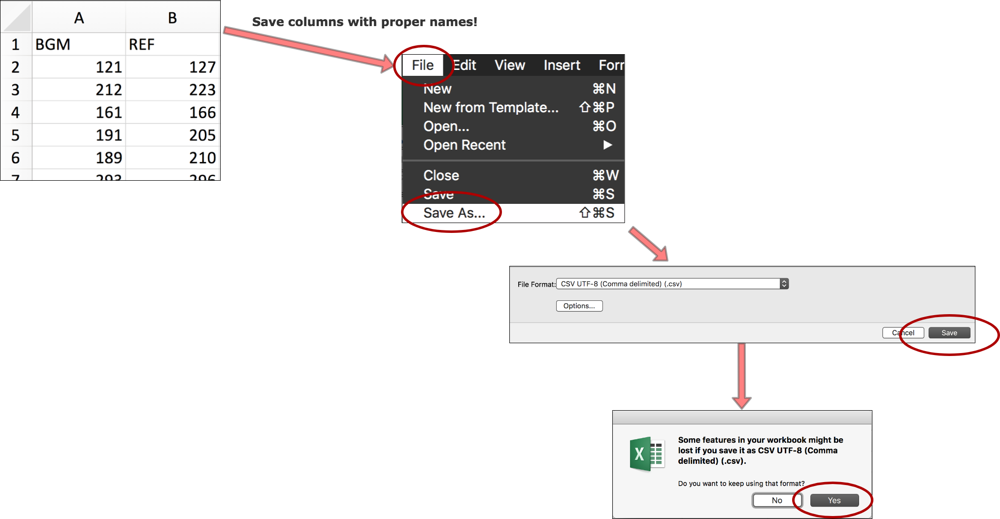
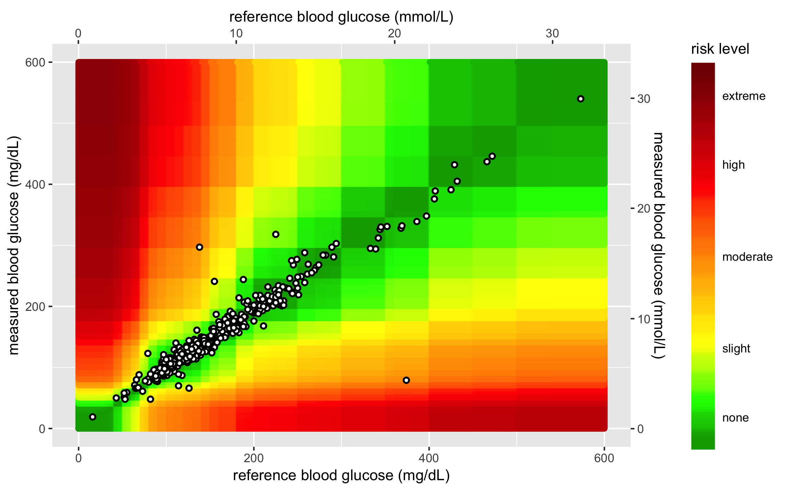
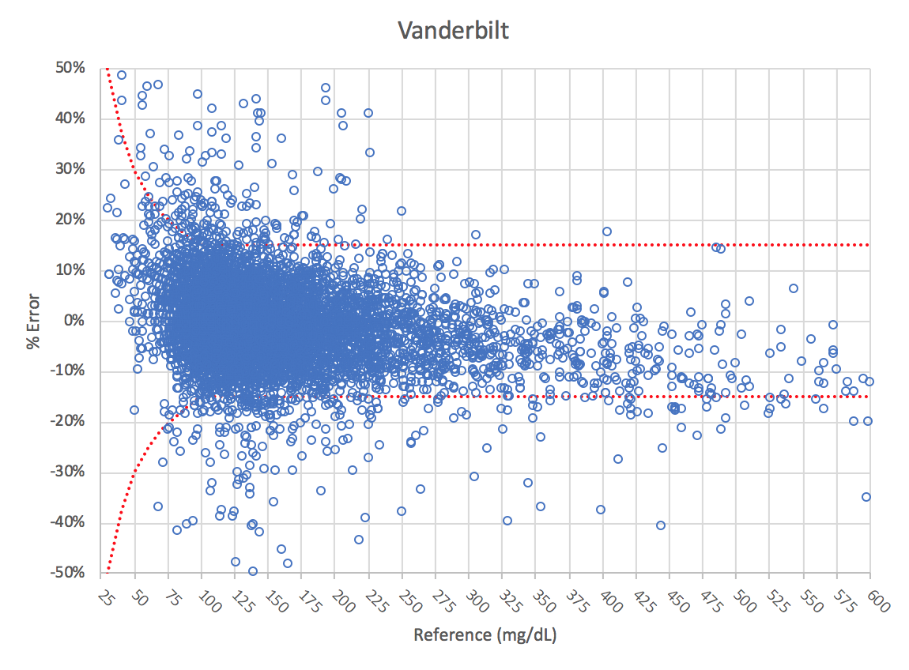

SEG Shiny Heatmap (phase 1)
================
Martin Frigaard
2018-08-22

**HEADER:**

  - **Created date:** 2018-08-22  
  - **R version:** R version 3.5.0 (2018-04-23)

-----

# Objective

Provide the background documentation and code for the Shiny SEG app.
This is currently version 1.5.1. The major changes to this app have been
documented below.

## News for Version 1.5.1\!\!

Major changes to this version include:

  - The font in the colored tables has been changed so it is easier to
    read.

  - include text values for `risk_cat_txt` in Risk Table 2

  - add `15-20` and `20+` to the iso range table.

  - add plain language interpretation of MARD2 table beyond ‘models
    indicate’

  - display first ten rows (instead of the option to view the entire
    data set)

-----

## 0.1 - Instructions table tab

This text is included on the instructions tab:

> *"Upload your data in a comma separated variables (CSV) file by
> clicking on the ‘Browse’ button in the left sidebar panel. Please
> refer to the image below. Your CSV file should contain only two
> columns. The blood glucose monitor (BGM) readings should be in the
> leftmost column under the heading ‘BGM’. These are the meter readings
> or point-of-care readings. The reference values should be in the next
> column under the label ‘REF’. Reference values might come from
> simultaneously obtained plasma specimens run on a laboratory analyzer
> such as the YSI Life Sciences 2300 Stat Plus Glucose Lactate Analyzer.
> If you have any questions about how your CSV data file should look
> before uploading it, please download the sample data set we have
> provided.*"



> *After you have uploaded your .csv file, click on the Create Summary
> Tables and the Create SEG Tables button in the left-hand panel. The
> results can be viewed on the ‘Summary Tables’ tab.*

> *When your .csv file finishes uploading, a static heatmap will be
> generated from the BGM and REF values. You may customize your static
> heatmap parameters in the left sidebar panel and download the heatmap
> to your computer (as either a .png or .pdf). See the example provided
> below:*



-----

## 0.2 - Summary tables tab

These tables are from the Vanderbilt excel file
`VanderbiltWithMetabolic-2018-06-11.xlsx`. The first is the summary pair
type table.

``` r
# writeLines(fs::dir_ls("./Excel"))
```

> The Surveillance Error Grid Analysis Tool Output: BGM = Blood Glucose
> Monitor REF = Reference This contains the number of BGM values that
> were 1) less than the REF values, 2) equal to the REF values, and 3)
> greater than the REF values. Note that REF values \< 21 mg/dL or \>600
> mg/dL will not be plotted on the SEG heatmap. This tab also stratifies
> the values across eight clinical risk levels.

``` r
PairType <- tibble::tribble(
                                    ~Pair.Type, ~Count,
           "REF <21: Included in SEG Analysis",     3L,
       "REF > 600: Excluded from SEG Analysis",    23L,
                                       "Total",  9891L,
                                   "BGM < REF",  4710L,
                                   "BGM = REF",   479L,
                                   "BGM > REF",  4702L,
              "Total included in SEG Analysis",  9868L)
PairType
```

    # A tibble: 7 x 2
      Pair.Type                             Count
      <chr>                                 <int>
    1 REF <21: Included in SEG Analysis         3
    2 REF > 600: Excluded from SEG Analysis    23
    3 Total                                  9891
    4 BGM < REF                              4710
    5 BGM = REF                               479
    6 BGM > REF                              4702
    7 Total included in SEG Analysis         9868

> Bias: Mean relative difference between BGM and REF ( BGM-REF )/ REF

> MARD: Mean Absolute Relative Difference. | BGM-REF | / REF

> CV: Standard Deviation of Relative Difference between BGM and REF

> Lower 95% Limit of Agreement: Bias - 1.96 x CV

> Upper 95% Limit of Agreement: Bias +1.96 x CV

``` r
MARDTable2 <- tibble::tribble(
       ~Total,   ~Bias,   ~MARD,      ~CV, ~Lower.95..Limit.of.Agreement, ~Upper.95..Limit.of.Agreement,
        9868L, "0.60%", "7.00%", "14.80%",                     "-28.30%",                      "29.60%")
MARDTable2
```

``` 
# A tibble: 1 x 6
  Total Bias  MARD  CV     Lower.95..Limit.of.Agr… Upper.95..Limit.of.Agr…
  <int> <chr> <chr> <chr>  <chr>                   <chr>                  
1  9868 0.60% 7.00% 14.80% -28.30%                 29.60%                 
```

  - The new risk grades were created in the following table.

<!-- end list -->

``` r
NewRiskGrades <- tibble::tribble(
       ~ID, ~Risk.Grade,    ~N, ~Percent,          ~REF,
        1L,         "A", 9474L, "96.00%",     "0 - 0.5",
        2L,         "B",  294L,  "3.00%", "> 0.5 - 1.0",
        3L,         "C",   79L,  "0.80%", "> 1.0 - 2.0",
        4L,         "D",   21L,  "0.20%", "> 2.0 - 3.0",
        5L,         "E",    0L,  "0.00%",       "> 3.0")
```

These are colored using the following formats.

``` r
NewRiskGrades %>%
    DT::datatable(.,options = list(lengthChange = FALSE, 
                             dom = 't', 
                             rownames = TRUE )) %>%
      # select numerical reference
      DT::formatStyle('ID', # column
                  target = "row", # reference rows
                  backgroundColor =
      DT::styleEqual(levels =  # five levels/labels
                    c(1, 2, 3, 4, 5),
                    values = c("limegreen", 
                               "greenyellow",
                                "yellow", 
                                "orange",
                                "red")))
```

<!-- -->

  - The following risk category table (`SEGRiskCategoryTable4`) was
    produced:

<!-- end list -->

``` r
SEGRiskCategoryTable4 <- tibble::tribble(
                                      ~ROW,           ~SEG.Risk.Category, ~Number.of.Pairs, ~Percent.Of.Pairs, ~Risk.Factor.Range,
                                       0,              "None 0 - 0.5*",            9474L,          "96.00%",        "0.0 - 0.5",
                                       1,  "Slight, Lower > 0.5 - 1.0",             294L,           "3.00%",       ">0.5 - 1.0",
                                       2,  "Slight, Higher >1.0 - 1.5",              55L,           "0.60%",       ">1.0 - 1.5",
                                       3,   "Moderate, Lower >1.5-2.0",              24L,           "0.20%",       ">1.5 - 2.0",
                                       4, "Moderate Higher, >2.0- 2.5",              11L,           "0.10%",       ">2.0 - 2.5",
                                       5,    "Severe, Lower > 2.5-3.0",              10L,           "0.10%",       ">2.5 - 3.0",
                                       6,    "Severe, Higher <3.0-3.5",               0L,           "0.00%",       ">3.0 - 3.5",
                                       7,               "Extreme> 3.5",               0L,           "0.00%",            "> 3.5")
SEGRiskCategoryTable4
```

``` 
# A tibble: 8 x 5
    ROW SEG.Risk.Catego… Number.of.Pairs Percent.Of.Pairs Risk.Factor.Ran…
  <dbl> <chr>                      <int> <chr>            <chr>           
1     0 None 0 - 0.5*               9474 96.00%           0.0 - 0.5       
2     1 Slight, Lower >…             294 3.00%            >0.5 - 1.0      
3     2 Slight, Higher …              55 0.60%            >1.0 - 1.5      
4     3 Moderate, Lower…              24 0.20%            >1.5 - 2.0      
5     4 Moderate Higher…              11 0.10%            >2.0 - 2.5      
6     5 Severe, Lower >…              10 0.10%            >2.5 - 3.0      
7     6 Severe, Higher …               0 0.00%            >3.0 - 3.5      
8     7 Extreme> 3.5                   0 0.00%            > 3.5           
```

These colors were added the larger risk category table in version 1.5.1

``` r
library(DT)
```

``` 

Attaching package: 'DT'
```

    The following objects are masked from 'package:shiny':
    
        dataTableOutput, renderDataTable

``` r
SEGRiskCategoryTable4 %>%
  datatable(.,options = list(lengthChange = FALSE, 
                             dom = 't', 
                             rownames = FALSE )) %>%
    # select numerical reference
        formatStyle('ROW',
                  target = "row",
                  backgroundColor = styleEqual(
                      levels =  # eight levels/labels
                            c(0, 1, 2, 3,
                                4, 5, 6, 7),
                        values = c("#00EE00", "#ADFF2F", "#FFFF00",
                                   "#FFD700", "#FFA500","#EE7600",
                                   "#FF4500", "#FF0000")))
```

<!-- -->

  - The following text was added under this table:

> “Models indicate that a device with \>= 97% pairs inside the SEG
> no-risk ‘green’ zone would meet the requirements of ≤ 5% data pairs
> outside the 15 mg/dL (0.83 mmol/L) / 15% standard limits, while higher
> percentages outside the SEG no-risk zone would indicate noncompliance
> with the standard. The Diabetes Technology Society Blood Glucose
> Monitor System (BGMS) Surveillance Program confirmed these ranges on
> 18 blood glucose monitoring systems using pre-determined analytical
> accuracy criteria agreed upon by the DTS-BGMS Surveillance Committee.”
> Source: *J Diabetes Sci Technol 8: 673-684, 2014. PMID: 25562887.*

``` r
# datapasta::tribble_paste()
ISORanges <- tibble::tribble(
                ~ISO.Range,    ~N,  ~Percent,
         "< 5% or 5 mg/dL", 5328L,  "54.00%",
         "5-<10% or mg/dL", 2842L,  "28.80%",
        "10-<15% or mg/dL", 1050L,  "10.60%",
 "\"> 15 - 20% or mg/dL\"",  648L,   "6.60%",
      "Total", 9868L, "100.00%")
ISORanges
```

    # A tibble: 5 x 3
      ISO.Range                     N Percent
      <chr>                     <int> <chr>  
    1 < 5% or 5 mg/dL            5328 54.00% 
    2 5-<10% or mg/dL            2842 28.80% 
    3 10-<15% or mg/dL           1050 10.60% 
    4 "\"> 15 - 20% or mg/dL\""   648 6.60%  
    5 Total                      9868 100.00%

  - This text was added beneath this table for clarity:

> *ISO range = difference between BGM and REF as percent of REF for REF
> \> 100 mg/dL and in mg/dL for REF \<= 100 mg/dL.*

  - The binomial test table (`BinomialTable`) was rebuilt using
    `qbinom()` and `tibble::as_tibble()`. This is the final table on the
    `Summary Tables` tab.

<!-- end list -->

``` r
BinomialTable <- tibble::tribble(
~Compliant.Pairs, ~Compliant.Pairs., ~Lower.Bound.for.Acceptance, ~Lower.Bound.for.Acceptance, ~Result,
        9220L,        "93.4%",   9339,       "94.6%",       "9220 < 9339 - Does not meet BGM Surveillance Study Accuracy Standard")
BinomialTable
```

    # A tibble: 1 x 5
      Compliant.Pairs Compliant.Pairs. Lower.Bound.for… Lower.Bound.for… Resu…
                <int> <chr>                       <dbl> <chr>            <chr>
    1            9220 93.4%                        9339 94.6%            9220…

  - the citation was added following this table:

> *Klonoff, D. C., et al. ‘Investigation of the Accuracy of 18 Marketed
> Blood Glucose Monitors.’ Diabetes Care. June 13, 2018. Epub ahead of
> print.*

-----

## Load custom functions

These are some custom functions for viewing and summarizing these data.

``` r
# writeLines(fs::dir_ls("Code"))
source("Code/my_r_funs_v1.4.R", echo = TRUE)
```

``` 

# R>require(tidyverse)

# R>require(magrittr)

# R>headTail = function(d, n = 5) rbind(head(x = d, n = n), 
+     tail(x = d, n = n))

# R>headSmall = function(d) d[1:5, 1:5]

# R>sectionLabel <- function(..., pad = "-") {
+     title <- paste0(...)
+     width <- getOption("width") - nchar(title) - 10
+     cat("# > ", titl .... [TRUNCATED] 

# R>sectionLabel("load functions")
# > load functions ---------------------------------------------------

# R>numvarSum <- function(df, expr) {
+     expr <- enquo(expr)
+     summarise(df, n = sum((!is.na(!!expr))), na = sum((is.na(!!expr))), 
+         m .... [TRUNCATED] 

# R>dataShape <- function(df) {
+     obs <- nrow(df)
+     vars <- ncol(df)
+     class <- paste0(class(df), collapse = "; ")
+     first_var <- base .... [TRUNCATED] 

# R>mtcars %>% dataShape()
Observations: 32
Variables: 11
Class(es):  data.frame 
First/last variable: mpg/carb
Grouped: FALSE
Top 5 & bottom 5 observations:
# A tibble: 10 x 11
     mpg   cyl  disp    hp  drat    wt  qsec    vs    am  gear  carb
   <dbl> <dbl> <dbl> <dbl> <dbl> <dbl> <dbl> <dbl> <dbl> <dbl> <dbl>
 1  21       6 160     110  3.9   2.62  16.5     0     1     4     4
 2  21       6 160     110  3.9   2.88  17.0     0     1     4     4
 3  22.8     4 108      93  3.85  2.32  18.6     1     1     4     1
 4  21.4     6 258     110  3.08  3.22  19.4     1     0     3     1
 5  18.7     8 360     175  3.15  3.44  17.0     0     0     3     2
 6  30.4     4  95.1   113  3.77  1.51  16.9     1     1     5     2
 7  15.8     8 351     264  4.22  3.17  14.5     0     1     5     4
 8  19.7     6 145     175  3.62  2.77  15.5     0     1     5     6
 9  15       8 301     335  3.54  3.57  14.6     0     1     5     8
10  21.4     4 121     109  4.11  2.78  18.6     1     1     4     2

# R>timeStamper <- function(...) {
+     mytime <- stringr::str_sub(string = as.character.Date(Sys.time()), 
+         start = 12, end = 19)
+     myd .... [TRUNCATED] 

# R>fileNamer <- function(..., version = "0.0", extension = ".R") {
+     title <- str_replace_all(string = ..., pattern = "\\W", replacement = "_")
+ .... [TRUNCATED] 

# R>normVarNames <- function(vars, sep = "_") {
+     if (sep == ".") 
+         sep <- "\\."
+     pat <- "_| |•| |,|-|:|/|&|\\.|\\?|\\[|\\]|\\{|\\}| ..." ... [TRUNCATED] 

# R>datevarSum <- function(df, expr) {
+     expr <- enquo(expr)
+     summarise(df, min = min(!!expr, na.rm = TRUE), median = median(!!expr, 
+       .... [TRUNCATED] 

# R>show_missings <- function(df) {
+     n <- sum(is.na(df))
+     cat("Missing values: ", n, "\n", sep = "")
+     invisible(df)
+ }
```

# PART 1 - Download data inputs

There are three data sets that need to be loaded from Github. The
following code goes into the `Code/helpers.R` file:

### 1.0 upload `AppRiskPairData.csv` from github

This uploads a wrangled data set into the app for risk pairs. These data
are ready to be mapped into the app and used to plot with the new data
points.

``` r
# define the root github raw
github_root <- "https://raw.githubusercontent.com/"
# 1.0 upload AppRiskPairData.csv from github  ---- ---- ---- ----
app_riskpair_repo <- "mjfrigaard/SEG_shiny/master/Data/AppRiskPairData.csv"
RiskPairData <- read_csv(paste0(github_root, app_riskpair_repo))
```

    Parsed with column specification:
    cols(
      RiskPairID = col_double(),
      REF = col_double(),
      BGM = col_double(),
      RiskFactor = col_double(),
      abs_risk = col_double()
    )

``` r
RiskPairData %>% dataShape()
```

    Observations: 361201
    Variables: 5
    Class(es):  tbl_df; tbl; data.frame 
    First/last variable: RiskPairID/abs_risk
    Grouped: FALSE
    Top 5 & bottom 5 observations:

    # A tibble: 10 x 5
       RiskPairID   REF   BGM RiskFactor abs_risk
            <dbl> <dbl> <dbl>      <dbl>    <dbl>
     1          1     0     0          0        0
     2          2     1     0          0        0
     3          3     2     0          0        0
     4          4     3     0          0        0
     5          5     4     0          0        0
     6     361197   596   600          0        0
     7     361198   597   600          0        0
     8     361199   598   600          0        0
     9     361200   599   600          0        0
    10     361201   600   600          0        0

``` r
# this is what the data frame should look like:
# Observations: 361201
# Variables: 5
# $ RiskPairID <int> ...
# $ REF        <int> ...
# $ BGM        <int> ...
# $ RiskFactor <dbl> ...
# $ abs_risk   <dbl> ...
```

### 1.1 load the `AppLookUpRiskCat.csv` from github

This uploads a wrangled data set into the app for a look-up table. To
see what wrangling steps had to be taken, consult the `Errata` section
below.

``` r
# 1.1 load the AppLookUpRiskCat.csv from github  ---- ---- ---- ---- ----
app_lookup_repo <- "mjfrigaard/SEG_shiny/master/Data/AppLookUpRiskCat.csv"
LookUpRiskCat <- read_csv(paste0(github_root, app_lookup_repo))
```

    Parsed with column specification:
    cols(
      risk_cat = col_double(),
      ABSLB = col_double(),
      ABSUB = col_double()
    )

``` r
LookUpRiskCat %>% dataShape()
```

    Observations: 8
    Variables: 3
    Class(es):  tbl_df; tbl; data.frame 
    First/last variable: risk_cat/ABSUB
    Grouped: FALSE
    Top 5 & bottom 5 observations:

``` 
# A tibble: 10 x 3
   risk_cat  ABSLB ABSUB
      <dbl>  <dbl> <dbl>
 1        0 -0.001   0.5
 2        1  0.5     1  
 3        2  1       1.5
 4        3  1.5     2  
 5        4  2       2.5
 6        3  1.5     2  
 7        4  2       2.5
 8        5  2.5     3  
 9        6  3       3.5
10        7  3.5    10  
```

``` r
# this is what the data frame should look like:
# Observations: 8
# Variables: 3
# $ risk_cat <int> 0, 1, 2,...
# $ ABSLB    <dbl> -0.001, ...
# $ ABSUB    <dbl> 0.5, 1.0...
```

### 1.2 import `FullSampleData.csv` data set from github

This loads the full sample data file from Vanderbilt. There are 7857
observations in this file, and only two variables. Each data set should
be loaded into the app using the guide provided on the first tab.

``` r
# 1.20 import full sample data set from github ---- ---- ---- ---- ----
vanderbilt_repo <- "mjfrigaard/SEG_shiny/master/Data/VanderbiltComplete.csv"
SampleData <- read_csv(paste0(github_root, vanderbilt_repo))
```

    Parsed with column specification:
    cols(
      BGM = col_double(),
      REF = col_double()
    )

``` r
SampleData %>% dataShape()
```

    Observations: 9891
    Variables: 2
    Class(es):  tbl_df; tbl; data.frame 
    First/last variable: BGM/REF
    Grouped: FALSE
    Top 5 & bottom 5 observations:

    # A tibble: 10 x 2
         BGM   REF
       <dbl> <dbl>
     1   121   127
     2   212   223
     3   161   166
     4   191   205
     5   189   210
     6    90    89
     7   150   165
     8   121   109
     9   168   160
    10   149   187

``` r
# Observations: 7857
# Variables: 2
```

### 1.3 export sample data set (`AppTestData`)

Now export the test data to the `app_data` folder. There are `3000`
observations in this data frame. This will get loaded to Github in the
data repository here:

  - <https://github.com/mjfrigaard/SEG_shiny/tree/master/Data>

<!-- end list -->

``` r
app_data_path <- "Data/"
# 1.4.1 create test data frame to export ----
AppTestData <- SampleData %>% sample_n(., size = 3000)
write_csv(as_data_frame(AppTestData), path = paste0(
  app_data_path,
  "AppTestData",
  ".csv"
))
# verify
# writeLines(fs::dir_ls(app_data_path))
```

### 1.4 Remove `AppTestData`/`SampleData` to avoid confusion\!

Now remove these last two data sets to avoid any confusion in the future
app development.

``` r
rm(SampleData, AppTestData)
ls()
```

``` 
 [1] "app_data_path"         "app_lookup_repo"      
 [3] "app_riskpair_repo"     "BinomialTable"        
 [5] "dataShape"             "datevarSum"           
 [7] "fileNamer"             "github_root"          
 [9] "headSmall"             "headTail"             
[11] "ISORanges"             "LookUpRiskCat"        
[13] "MARDTable2"            "NewRiskGrades"        
[15] "normVarNames"          "numvarSum"            
[17] "PairType"              "RiskPairData"         
[19] "sectionLabel"          "SEGRiskCategoryTable4"
[21] "show_missings"         "timeStamper"          
[23] "vanderbilt_repo"      
```

# PART 2 - Prepare an example uploaded data file

We can assume from this point forward that `SampMeasData` is an imported
data frame the user will upload. All changes to this data frame will
need to be done as a ‘reactive expression’, meaning the input will
change every time a new data set it uploaded.

To start with, we will upload the complete data we will use to make sure
the wrangling/calculations are correct. The first step is to name the
entire `VanderbiltComplete.csv` data set `SampMeasData`.

``` r
# 1.6.1 load the vanderbilt data set ---- ---- ---- ----
# writeLines(fs::dir_ls(app_data_path))
vanderbilt_repo <- "mjfrigaard/SEG_shiny/master/Data/VanderbiltComplete.csv"
SampMeasData <- read_csv(paste0(github_root, vanderbilt_repo))
```

    Parsed with column specification:
    cols(
      BGM = col_double(),
      REF = col_double()
    )

``` r
SampMeasData %>% dataShape()
```

    Observations: 9891
    Variables: 2
    Class(es):  tbl_df; tbl; data.frame 
    First/last variable: BGM/REF
    Grouped: FALSE
    Top 5 & bottom 5 observations:

    # A tibble: 10 x 2
         BGM   REF
       <dbl> <dbl>
     1   121   127
     2   212   223
     3   161   166
     4   191   205
     5   189   210
     6    90    89
     7   150   165
     8   121   109
     9   168   160
    10   149   187

``` r
# Observations: 9891
# Variables: 2
```

All of this code needs to be in the `app.R` and `helpers.R` files.

### 2.2 Create the `REF` and `BGM` pair type variables

This is the portion that identifies which values are in range and which
ones are out of range.

``` r
# 2.2.1 ----
SampMeasData %>% dplyr::filter(REF < 21) %>% nrow()
```

    [1] 3

``` r
SampMeasData %>% dplyr::filter(REF > 600) %>% nrow()
```

    [1] 23

``` r
SampMeasData %>% dplyr::filter(REF > BGM) %>% nrow()
```

    [1] 4710

``` r
SampMeasData %>% dplyr::filter(REF < BGM) %>% nrow()
```

    [1] 4702

``` r
SampMeasData %>% dplyr::filter(REF == BGM) %>% nrow()
```

    [1] 479

Create the category
variables.

``` r
# 2.2.2 create bgm_pair_cat ---- ----  ---- ----  ---- ----  ---- ----  ----
SampMeasData <- SampMeasData %>%
  dplyr::mutate(
    bgm_pair_cat =
      dplyr::case_when(
        BGM < REF ~ "BGM < REF",
        BGM == REF ~ "BGM = REF",
        BGM > REF ~ "BGM > REF"
      )
  )
# SampMeasData %>% dplyr::count(bgm_pair_cat)
# 2.2.3 create ref_pair_2cat ---- ----  ---- ----  ---- ----  ---- ----  ----
SampMeasData <- SampMeasData %>%
  dplyr::mutate(
    ref_pair_2cat =
      dplyr::case_when(
        REF > 600 ~ "REF > 600: Excluded from SEG Analysis",
        REF < 21 & REF <= 600 ~ "REF <21: Included in SEG Analysis"
      )
  )
# 2.2.4 create included ---- ----  ---- ----  ---- ----  ---- ----  ----
SampMeasData <- SampMeasData %>%
  dplyr::mutate(
    included =
      dplyr::case_when(
        REF <= 600 ~ "Total included in SEG Analysis",
        REF > 600 ~ "Total excluded in SEG Analysis"
      )
  )
```

#### 2.2.5 - Check these new variables

``` r
SampMeasData %>% dplyr::count(bgm_pair_cat)
```

    # A tibble: 3 x 2
      bgm_pair_cat     n
      <chr>        <int>
    1 BGM < REF     4710
    2 BGM = REF      479
    3 BGM > REF     4702

``` r
SampMeasData %>% dplyr::count(ref_pair_2cat)
```

    # A tibble: 3 x 2
      ref_pair_2cat                             n
      <chr>                                 <int>
    1 <NA>                                   9865
    2 REF <21: Included in SEG Analysis         3
    3 REF > 600: Excluded from SEG Analysis    23

``` r
SampMeasData %>% dplyr::count(included)
```

    # A tibble: 2 x 2
      included                           n
      <chr>                          <int>
    1 Total excluded in SEG Analysis    23
    2 Total included in SEG Analysis  9868

### 2.3 Create the count tibbles

Now create the count tibbles to be displayed in the app.

``` r
# 2.3.1 create BGMPairs ---- ---- ---- ----
BGMPairs <- SampMeasData %>%
  dplyr::count(bgm_pair_cat) %>%
  dplyr::rename(
    `Pair Type` = bgm_pair_cat,
    Count = n
  )
# 2.4.1 create REFPairs ---- ---- ---- ----
REFPairs <- SampMeasData %>%
  dplyr::count(ref_pair_2cat) %>%
  dplyr::rename(
    `Pair Type` = ref_pair_2cat,
    Count = n
  ) %>%
  dplyr::filter(!is.na(`Pair Type`))
# 2.5.1 create Included ---- ---- ---- ----
Included <- SampMeasData %>%
  dplyr::count(included) %>%
  dplyr::rename(
    `Pair Type` = included,
    Count = n
  ) %>%
  dplyr::filter(`Pair Type` == "Total included in SEG Analysis")
```

### 2.4 Bind count tibbles into `PairTypeTable`

Bind these rows and add the `Total Rows` category.

``` r
# 2.4.1 create ----  ----  ----  ----
PairTypeTable <- dplyr::bind_rows(BGMPairs, REFPairs, Included)
# 2.4.2 add the Total row  ----  ----  ----  ----
PairTypeTable <- PairTypeTable %>% tibble::add_row(
  `Pair Type` = "Total",
  Count = nrow(SampMeasData),
  .after = 3
)
PairTypeTable
```

    # A tibble: 7 x 2
      `Pair Type`                           Count
      <chr>                                 <int>
    1 BGM < REF                              4710
    2 BGM = REF                               479
    3 BGM > REF                              4702
    4 Total                                  9891
    5 REF <21: Included in SEG Analysis         3
    6 REF > 600: Excluded from SEG Analysis    23
    7 Total included in SEG Analysis         9868

Now the numbers look identical to the Excel table in the
`VanderbiltWithMetabolic-2018-06-11.xlsx` found below:

``` r
# fs::dir_ls("Excel", regexp = "Metab")
```

I can use a trick from `datapasta` to compare these two tables.

``` r
# datapasta::tribble_paste()
ExcelPairType <- tibble::tribble(
  ~`Pair Type`, ~Count,
  "BGM < REF", 4710L,
  "BGM = REF", 479L,
  "BGM > REF", 4702L,
  "Total", 9891L,
  "REF > 600: Excluded from SEG Analysis", 23L,
  "REF <21: Included in SEG Analysis", 3L,
  "Total included in SEG Analysis", 9868L,
)
ExcelPairType
```

    # A tibble: 7 x 2
      `Pair Type`                           Count
      <chr>                                 <int>
    1 BGM < REF                              4710
    2 BGM = REF                               479
    3 BGM > REF                              4702
    4 Total                                  9891
    5 REF > 600: Excluded from SEG Analysis    23
    6 REF <21: Included in SEG Analysis         3
    7 Total included in SEG Analysis         9868

``` r
PairTypeTable
```

    # A tibble: 7 x 2
      `Pair Type`                           Count
      <chr>                                 <int>
    1 BGM < REF                              4710
    2 BGM = REF                               479
    3 BGM > REF                              4702
    4 Total                                  9891
    5 REF <21: Included in SEG Analysis         3
    6 REF > 600: Excluded from SEG Analysis    23
    7 Total included in SEG Analysis         9868

The only difference here is the two `REF <21: Included in SEG Analysis`
and `REF > 600: Excluded from SEG Analysis` are reversed.

## 2.5 Join `RiskPairData` and `SampMeasData`

Now join these two data frames together.

``` r
# 2.5.1 Join RiskPairData data to SampMeasData data ---- ---- ---- ----
SampMeasData <- inner_join(
  x = SampMeasData,
  y = RiskPairData,
  by = c("BGM", "REF")
)
SampMeasData %>% dataShape()
```

    Observations: 9868
    Variables: 8
    Class(es):  tbl_df; tbl; data.frame 
    First/last variable: BGM/abs_risk
    Grouped: FALSE
    Top 5 & bottom 5 observations:

    # A tibble: 10 x 8
         BGM   REF bgm_pair_cat ref_pair_2cat included RiskPairID RiskFactor
       <dbl> <dbl> <chr>        <chr>         <chr>         <dbl>      <dbl>
     1   121   127 BGM < REF    <NA>          Total i…      72849    0.00254
     2   212   223 BGM < REF    <NA>          Total i…     127636    0.0280 
     3   161   166 BGM < REF    <NA>          Total i…      96928    0      
     4   191   205 BGM < REF    <NA>          Total i…     114997    0.206  
     5   189   210 BGM < REF    <NA>          Total i…     113800    0.209  
     6    90    89 BGM > REF    <NA>          Total i…      54180   -0.0153 
     7   150   165 BGM < REF    <NA>          Total i…      90316    0.282  
     8   121   109 BGM > REF    <NA>          Total i…      72831   -0.191  
     9   168   160 BGM > REF    <NA>          Total i…     101129   -0.137  
    10   149   187 BGM < REF    <NA>          Total i…      89737    0.725  
    # … with 1 more variable: abs_risk <dbl>

This what you should see.

``` r
# Observations: 9868
# Variables: 8
# First/last variable: BGM/abs_risk
```

``` r
SampMeasData %>% dplyr::count(bgm_pair_cat)
```

    # A tibble: 3 x 2
      bgm_pair_cat     n
      <chr>        <int>
    1 BGM < REF     4687
    2 BGM = REF      479
    3 BGM > REF     4702

The `BGM < REF` is no longer `4710`, because we’ve removed the 23
observations who are: `REF > 600: Excluded from SEG Analysis`

### 2.6 Create `risk_cat` variable

This will create the `risk_cat` variable. This variable maps numerical
values to the absolute value of the lower bound risk. It uses
`base::interval()` and the `abs_risk` variable (which is the absolute
value of the risk).

``` r
# 2.6.1 Create risk_cat variable ---- ---- ----- ----
# based on absolute value of risk factor
SampMeasData <- SampMeasData %>%
  dplyr::mutate(
    risk_cat =
      base::findInterval(
        x = abs_risk, # the abs_risk absolute value
        vec = LookUpRiskCat$ABSLB, # the lower bound absolute risk
        left.open = TRUE
      ) - 1
  )
SampMeasData %>%
  dplyr::count(risk_cat)
```

    # A tibble: 6 x 2
      risk_cat     n
         <dbl> <int>
    1        0  9474
    2        1   294
    3        2    55
    4        3    24
    5        4    11
    6        5    10

### 2.7 Join `SampMeasData` to `LookUpRiskCat`

Now I will join the `SampMeasData` to the `LookUpRiskCat` (a look-up
table).

``` r
SampMeasData <- dplyr::inner_join(SampMeasData,
  y = LookUpRiskCat, # inner join to look-up
  by = "risk_cat"
)
SampMeasData %>% dataShape()
```

    Observations: 9868
    Variables: 11
    Class(es):  tbl_df; tbl; data.frame 
    First/last variable: BGM/ABSUB
    Grouped: FALSE
    Top 5 & bottom 5 observations:

    # A tibble: 10 x 11
         BGM   REF bgm_pair_cat ref_pair_2cat included RiskPairID RiskFactor
       <dbl> <dbl> <chr>        <chr>         <chr>         <dbl>      <dbl>
     1   121   127 BGM < REF    <NA>          Total i…      72849    0.00254
     2   212   223 BGM < REF    <NA>          Total i…     127636    0.0280 
     3   161   166 BGM < REF    <NA>          Total i…      96928    0      
     4   191   205 BGM < REF    <NA>          Total i…     114997    0.206  
     5   189   210 BGM < REF    <NA>          Total i…     113800    0.209  
     6    90    89 BGM > REF    <NA>          Total i…      54180   -0.0153 
     7   150   165 BGM < REF    <NA>          Total i…      90316    0.282  
     8   121   109 BGM > REF    <NA>          Total i…      72831   -0.191  
     9   168   160 BGM > REF    <NA>          Total i…     101129   -0.137  
    10   149   187 BGM < REF    <NA>          Total i…      89737    0.725  
    # … with 4 more variables: abs_risk <dbl>, risk_cat <dbl>, ABSLB <dbl>,
    #   ABSUB <dbl>

This creates a data frame with 9868 observations and 11 variables.

``` r
PairTypeTable
```

    # A tibble: 7 x 2
      `Pair Type`                           Count
      <chr>                                 <int>
    1 BGM < REF                              4710
    2 BGM = REF                               479
    3 BGM > REF                              4702
    4 Total                                  9891
    5 REF <21: Included in SEG Analysis         3
    6 REF > 600: Excluded from SEG Analysis    23
    7 Total included in SEG Analysis         9868

The `BGM < REF` = `4710` here reflects the entire data set.

``` r
SampMeasData %>% dplyr::count(bgm_pair_cat)
```

    # A tibble: 3 x 2
      bgm_pair_cat     n
      <chr>        <int>
    1 BGM < REF     4687
    2 BGM = REF      479
    3 BGM > REF     4702

The `BGM < REF` = `4687` reflects the `4710` minus the `23` `REF` that
were greater than `600`. This difference in the `BGM < REF` categories
in these two tibbles because the `bgm_pair_cat` is removing the `23`
`REF` that are not included in the `SEG` analysis.

### 2.8 Create the `risk_cat_txt` variable

The `risk_cat_txt` variable

``` r
# 2.8.1 create the risk cat text variable ---- ---- ---- ----
SampMeasData <- SampMeasData %>%
  dplyr::mutate(
    risk_cat_txt =
      dplyr::case_when(
        abs_risk < 0.5 ~ "None",
        abs_risk >= 0.5 & abs_risk <= 1 ~ "Slight, Lower",
        abs_risk > 1 & abs_risk <= 1.5 ~ "Slight, Higher",
        abs_risk > 1.5 & abs_risk <= 2.0 ~ "Moderate, Lower",
        abs_risk > 2 & abs_risk <= 2.5 ~ "Moderate, Higher",
        abs_risk > 2.5 & abs_risk <= 3.0 ~ "Severe, Lower",
        abs_risk > 3.0 & abs_risk <= 3.5 ~ "Severe, Higher",
        abs_risk > 3.5 ~ "Extreme"
      )
  )
```

``` r
# 2.8.2 verify risk_cat_txt ---- ---- ---- -----
SampMeasData %>%
  dplyr::group_by(risk_cat_txt) %>%
  numvarSum(abs_risk) %>%
  dplyr::select(risk_cat_txt, n, min, max) %>%
  dplyr::arrange(desc(n))
```

    # A tibble: 6 x 4
      risk_cat_txt         n   min   max
      <chr>            <int> <dbl> <dbl>
    1 None              9474 0     0.491
    2 Slight, Lower      294 0.501 0.997
    3 Slight, Higher      55 1.03  1.49 
    4 Moderate, Lower     24 1.52  1.98 
    5 Moderate, Higher    11 2.01  2.43 
    6 Severe, Lower       10 2.53  2.81 

Format the `REF` and `BGM` variables as `double()`.

``` r
# 2.8.3 format REF and BGM as double ---- ---- ---- ----
SampMeasData$REF <- as.double(SampMeasData$REF)
SampMeasData$BGM <- as.double(SampMeasData$BGM)
SampMeasData$REF %>% glimpse(78)
```

``` 
 num [1:9868] 127 223 166 205 210 100 296 142 231 148 ...
```

``` r
SampMeasData$BGM %>% glimpse(78)
```

``` 
 num [1:9868] 121 212 161 191 189 104 293 130 261 147 ...
```

## PART 3 - Calculate MARD, ISO difference, and ISO range

This section recreates the summary statistics in the excel sheet sent to
Vanderbilt.

``` r
# 3 - CALCULATE SUMMARY STATS ---- ---- ---- ----
SampMeasData %>% dataShape()
```

    Observations: 9868
    Variables: 12
    Class(es):  tbl_df; tbl; data.frame 
    First/last variable: BGM/risk_cat_txt
    Grouped: FALSE
    Top 5 & bottom 5 observations:

    # A tibble: 10 x 12
         BGM   REF bgm_pair_cat ref_pair_2cat included RiskPairID RiskFactor
       <dbl> <dbl> <chr>        <chr>         <chr>         <dbl>      <dbl>
     1   121   127 BGM < REF    <NA>          Total i…      72849    0.00254
     2   212   223 BGM < REF    <NA>          Total i…     127636    0.0280 
     3   161   166 BGM < REF    <NA>          Total i…      96928    0      
     4   191   205 BGM < REF    <NA>          Total i…     114997    0.206  
     5   189   210 BGM < REF    <NA>          Total i…     113800    0.209  
     6    90    89 BGM > REF    <NA>          Total i…      54180   -0.0153 
     7   150   165 BGM < REF    <NA>          Total i…      90316    0.282  
     8   121   109 BGM > REF    <NA>          Total i…      72831   -0.191  
     9   168   160 BGM > REF    <NA>          Total i…     101129   -0.137  
    10   149   187 BGM < REF    <NA>          Total i…      89737    0.725  
    # … with 5 more variables: abs_risk <dbl>, risk_cat <dbl>, ABSLB <dbl>,
    #   ABSUB <dbl>, risk_cat_txt <chr>

``` r
# Observations: 9868
# Variables: 12
# Class(es):  tbl_df; tbl; data.frame
# First/last variable: BGM/risk_cat_txt
```

Specifically, it will calculate the summary stats for the MARD table,
the ISO difference, and the ISO
range.

### 3.1.1 - Calculate the relative difference & absolute relative difference

  - First it creates the relative difference: `rel_diff = (BGM - REF) /
    REF`

  - Then is creates the absolute value of the relative difference:
    `abs_rel_diff =
abs(rel_diff)`

<!-- end list -->

``` r
# 3.1.1 create relative diff/absolute relative diff variables ---- ---- ---- ----
SampMeasData <- SampMeasData %>%
  mutate(
    rel_diff = (BGM - REF) / REF, # relative diff
    abs_rel_diff = abs(rel_diff)
  ) # abs relative diff
SampMeasData %>%
  dplyr::select(
    BGM,
    REF,
    rel_diff,
    abs_rel_diff
  ) %>%
  utils::head()
```

``` 
# A tibble: 6 x 4
    BGM   REF rel_diff abs_rel_diff
  <dbl> <dbl>    <dbl>        <dbl>
1   121   127  -0.0472       0.0472
2   212   223  -0.0493       0.0493
3   161   166  -0.0301       0.0301
4   191   205  -0.0683       0.0683
5   189   210  -0.1          0.1   
6   104   100   0.04         0.04  
```

### 3.1.2 - Create the squared root of the relative difference

We now create the squared root of the relative difference: `sq_rel_diff
= rel_diff^2`.

``` r
# 3.1.2 create squared relative diff variable ---- ---- ---- ----
SampMeasData <- SampMeasData %>%
  mutate(sq_rel_diff = rel_diff^2)
SampMeasData %>%
  dplyr::select(
    BGM,
    REF,
    rel_diff,
    abs_rel_diff,
    sq_rel_diff
  ) %>%
  utils::head()
```

``` 
# A tibble: 6 x 5
    BGM   REF rel_diff abs_rel_diff sq_rel_diff
  <dbl> <dbl>    <dbl>        <dbl>       <dbl>
1   121   127  -0.0472       0.0472    0.00223 
2   212   223  -0.0493       0.0493    0.00243 
3   161   166  -0.0301       0.0301    0.000907
4   191   205  -0.0683       0.0683    0.00466 
5   189   210  -0.1          0.1       0.01    
6   104   100   0.04         0.04      0.0016  
```

### 3.1.3 - Create the ‘ISO Difference’ variable

The `iso_diff` variable is created with two `if_else()` statements.

  - **Condition 1**: if `REF` is greater than or equal to `100` is
    `TRUE`, then take `100 * abs(BGM - REF) / REF`, if `FALSE` then
    defer to condition 2

  - **Condition 2**: if `REF` is less than `100` is `TRUE`, then take
    `abs(BGM - REF)`, if `FALSE` then input `NA_REAL_`

<!-- end list -->

``` r
# 3.1.3 create iso_diff variable ---- ---- ---- ----
SampMeasData$BGM <- as.double(SampMeasData$BGM)
SampMeasData$REF <- as.double(SampMeasData$REF)
SampMeasData <- SampMeasData %>%
  dplyr::mutate(
    iso_diff =
      if_else(REF >= 100, # condition 1
        100 * abs(BGM - REF) / REF, # T 1
        if_else(REF < 100, # condition 2
          abs(BGM - REF), # T 2
          NA_real_
        ), # F 2
        NA_real_
      )
  ) # F 1
```

We can test this by taking a few test cases. First we check the REF
values greater than or equal to `100`.

``` r
SampMeasData %>%
  dplyr::filter(REF >= 100) %>%
  dplyr::select(
    iso_diff,
    BGM,
    REF,
    abs_risk
  ) %>%
  utils::head(3)
```

``` 
# A tibble: 3 x 4
  iso_diff   BGM   REF abs_risk
     <dbl> <dbl> <dbl>    <dbl>
1     4.72   121   127  0.00254
2     4.93   212   223  0.0280 
3     3.01   161   166  0      
```

If we take a `REF` value of `127`, then the corresponding `iso_diff`
should be:

``` r
# 100 * abs(BGM - REF) / REF
100 * abs(121 - 127) / 127
```

    [1] 4.724

And for this test, we will look for `REF` values that are less than
`100`.

``` r
SampMeasData %>%
  dplyr::filter(REF < 100) %>%
  dplyr::select(
    iso_diff,
    BGM,
    REF,
    abs_risk
  ) %>%
  utils::head(3)
```

    # A tibble: 3 x 4
      iso_diff   BGM   REF abs_risk
         <dbl> <dbl> <dbl>    <dbl>
    1        2    83    81  0.00509
    2        3    95    92  0      
    3        2    67    69  0.00254

I will select the `BGM` value of `95`, and the `REF` value of `92`.

``` r
# 100 * abs(BGM - REF) / REF
as.double(100 * abs(95 - 92) / 92)
```

    [1] 3.261

### 3.1.4 - Create the ‘ISO Range’ variable

This will create the `iso_range` variable, which uses the following
categories:

  - if the `iso_diff` is less than or equal to `5`, then `"<5% or 5
    mg/dL"`,

  - if the `iso_diff` is greater than `5` and less than or equal to
    `10`, then `"5 - <10% or mg/dL"`,

  - if the `iso_diff` is greater than `10` and less than or equal to
    `15`, then `"10 - <15% or mg/dL"`,

  - if the `iso_diff` is greater than or equal to `15`, then `">= 15%
    or 15
mg/dL"`

<!-- end list -->

``` r
# 3.1.4 create iso range variable ---- ---- ---- ---- ---- ---- ---- ---- ----
SampMeasData <- SampMeasData %>%
  dplyr::mutate(
      iso_range =
      dplyr::case_when(
        iso_diff <= 5 ~ "<= 5% or 5 mg/dL",
        iso_diff > 5 & iso_diff <= 10 ~ "> 5 - 10% or mg/dL",
        iso_diff > 10 & iso_diff <= 15 ~ "> 10 - 15% or mg/dL",
        iso_diff > 15 & iso_diff <= 20 ~ "> 15 - 20% mg/dL",
        iso_diff > 20 ~ "> 20% or 20 mg/dL"
      ))
SampMeasData %>% dplyr::count(iso_range, sort = TRUE)
```

    # A tibble: 5 x 2
      iso_range               n
      <chr>               <int>
    1 <= 5% or 5 mg/dL     5328
    2 > 5 - 10% or mg/dL   2842
    3 > 10 - 15% or mg/dL  1050
    4 > 15 - 20% mg/dL      340
    5 > 20% or 20 mg/dL     308

## PART 4 - Create function for PARTS 2 & 3

### 4.0.0 - Re-create the excel tables

Recall the tables from Excel below:

``` r
# ls()
PairTypeTable
```

    # A tibble: 7 x 2
      `Pair Type`                           Count
      <chr>                                 <int>
    1 BGM < REF                              4710
    2 BGM = REF                               479
    3 BGM > REF                              4702
    4 Total                                  9891
    5 REF <21: Included in SEG Analysis         3
    6 REF > 600: Excluded from SEG Analysis    23
    7 Total included in SEG Analysis         9868

``` r
MARDTable2
```

``` 
# A tibble: 1 x 6
  Total Bias  MARD  CV     Lower.95..Limit.of.Agr… Upper.95..Limit.of.Agr…
  <int> <chr> <chr> <chr>  <chr>                   <chr>                  
1  9868 0.60% 7.00% 14.80% -28.30%                 29.60%                 
```

``` r
NewRiskGrades
```

``` 
# A tibble: 5 x 5
     ID Risk.Grade     N Percent REF        
  <int> <chr>      <int> <chr>   <chr>      
1     1 A           9474 96.00%  0 - 0.5    
2     2 B            294 3.00%   > 0.5 - 1.0
3     3 C             79 0.80%   > 1.0 - 2.0
4     4 D             21 0.20%   > 2.0 - 3.0
5     5 E              0 0.00%   > 3.0      
```

``` r
SEGRiskCategoryTable4
```

``` 
# A tibble: 8 x 5
    ROW SEG.Risk.Catego… Number.of.Pairs Percent.Of.Pairs Risk.Factor.Ran…
  <dbl> <chr>                      <int> <chr>            <chr>           
1     0 None 0 - 0.5*               9474 96.00%           0.0 - 0.5       
2     1 Slight, Lower >…             294 3.00%            >0.5 - 1.0      
3     2 Slight, Higher …              55 0.60%            >1.0 - 1.5      
4     3 Moderate, Lower…              24 0.20%            >1.5 - 2.0      
5     4 Moderate Higher…              11 0.10%            >2.0 - 2.5      
6     5 Severe, Lower >…              10 0.10%            >2.5 - 3.0      
7     6 Severe, Higher …               0 0.00%            >3.0 - 3.5      
8     7 Extreme> 3.5                   0 0.00%            > 3.5           
```

``` r
ISORanges
```

    # A tibble: 5 x 3
      ISO.Range                     N Percent
      <chr>                     <int> <chr>  
    1 < 5% or 5 mg/dL            5328 54.00% 
    2 5-<10% or mg/dL            2842 28.80% 
    3 10-<15% or mg/dL           1050 10.60% 
    4 "\"> 15 - 20% or mg/dL\""   648 6.60%  
    5 Total                      9868 100.00%

``` r
BinomialTable
```

    # A tibble: 1 x 5
      Compliant.Pairs Compliant.Pairs. Lower.Bound.for… Lower.Bound.for… Resu…
                <int> <chr>                       <dbl> <chr>            <chr>
    1            9220 93.4%                        9339 94.6%            9220…

Parts 2 and 3 needs to be in a function, like the one below:

``` r
clean_weather <- function(file) {
  weather <- read.fwf(file,
    header = FALSE,
    col.names = c("month", "day", "year", "temp"),
    widths = c(14, 14, 13, 4)
  )
  weather %>%
    filter(!(month == 2 & day == 29)) %>%
    group_by(year) %>%
    mutate(yearday = 1:length(day)) %>%
    ungroup() %>%
    filter(temp != -99)
}
clean_weather("Data/Raw/NYNEWYOR.txt") %>% glimpse(30)
```

### 4 - Create `pairtypeTable()` function

This app needs a helper function that takes 1) an uploaded .csv file, 2)
wrangles this .csv file by adding a few variables, joining to
`RiskPairData` and `LookUpRiskCat`, and 3) calculating the variables for
the MARD, binomial test, etc.

``` r
require(dplyr) # Data wrangling, glimpse(50) and tbl_df().
require(ggplot2) # Visualise data.
require(lubridate) # Dates and time.
require(readr) # Efficient reading of CSV data.
require(stringr) # String operations.
require(tibble) # Convert row names into a column.
require(tidyr) # Prepare a tidy dataset, gather().
require(magrittr) # Pipes %>%, %T>% and equals(), extract().
require(tidyverse) # all tidyverse packages
require(mosaic) # favstats and other summary functions
require(fs) # file management functions
require(shiny) # apps
require(datapasta) # for pasting tibbles
pairtypeTable <- function(file) {
  # 4.1.1 - import data frame ----
  SampMeasData <- readr::read_csv(file,
    col_types =
      cols(
        BGM = readr::col_double(),
        REF = readr::col_double()
      )
  )
  # 4.1.2 create bgm_pair_cat ---- ----  ---- ----  ---- ----  ---- ----
  SampMeasData <- SampMeasData %>%
    dplyr::mutate(
      bgm_pair_cat =
        dplyr::case_when(
          BGM < REF ~ "BGM < REF",
          BGM == REF ~ "BGM = REF",
          BGM > REF ~ "BGM > REF"
        )
    ) %>%
    # 4.1.3 create ref_pair_2cat ---- ----  ---- ----  ---- ----  ---- ----
    dplyr::mutate(
      ref_pair_2cat =
        dplyr::case_when(
          REF > 600 ~ "REF > 600: Excluded from SEG Analysis",
          REF < 21 & REF <= 600 ~ "REF <21: Included in SEG Analysis"
        )
    ) %>%
    # 4.1.4 create included ---- ----  ---- ----  ---- ----  ---- ----  ----
    dplyr::mutate(
      included =
        dplyr::case_when(
          REF <= 600 ~ "Total included in SEG Analysis",
          REF > 600 ~ "Total excluded in SEG Analysis"
        )
    )
  # 4.1.5 create BGMPairs ---- ---- ---- ----
  BGMPairs <- SampMeasData %>%
    dplyr::count(bgm_pair_cat) %>%
    dplyr::rename(
      `Pair Type` = bgm_pair_cat,
      Count = n
    )
  # 4.1.6 create REFPairs ---- ---- ---- ----
  REFPairs <- SampMeasData %>%
    dplyr::count(ref_pair_2cat) %>%
    dplyr::rename(
      `Pair Type` = ref_pair_2cat,
      Count = n
    ) %>%
    dplyr::filter(!is.na(`Pair Type`))
  # 4.1.7 create Included ---- ---- ---- ----
  Included <- SampMeasData %>%
    dplyr::count(included) %>%
    dplyr::rename(
      `Pair Type` = included,
      Count = n
    ) %>%
    dplyr::filter(`Pair Type` == "Total included in SEG Analysis")

  # 4.1.8 create ----  ----  ----  ----
  PairTypeTable <- dplyr::bind_rows(REFPairs, BGMPairs, Included)
  # 4.1.9 add the Total row  ----  ----  ----  ----
  PairTypeTable <- PairTypeTable %>% tibble::add_row(
    `Pair Type` = "Total",
    Count = nrow(SampMeasData),
    .after = 2
  )
  return(PairTypeTable)
}
```

### 4.2 - Test `pairtypeTable()` function

Now test this new function and see if it returns the `PairTypeTable`.

``` r
github_root <- "https://raw.githubusercontent.com/"
vanderbilt_repo <- "mjfrigaard/SEG_shiny/master/Data/VanderbiltComplete.csv"
PairTypeTable1 <- pairtypeTable(paste0(github_root, vanderbilt_repo))
PairTypeTable1
```

    # A tibble: 7 x 2
      `Pair Type`                           Count
      <chr>                                 <int>
    1 REF <21: Included in SEG Analysis         3
    2 REF > 600: Excluded from SEG Analysis    23
    3 Total                                  9891
    4 BGM < REF                              4710
    5 BGM = REF                               479
    6 BGM > REF                              4702
    7 Total included in SEG Analysis         9868

Now we can test this function with some sample data drawn from the
github repo.

``` r
github_root <- "https://raw.githubusercontent.com/"
vanderbilt_repo <- "mjfrigaard/SEG_shiny/master/Data/VanderbiltComplete.csv"
SampleData <- read_csv(paste0(github_root, vanderbilt_repo))
```

    Parsed with column specification:
    cols(
      BGM = col_double(),
      REF = col_double()
    )

``` r
# 4.2.3 create data frame to test prepare_csv() ----
AppTestDataSmall <- SampleData %>% sample_n(., size = 1000)
write_csv(
  as_data_frame(AppTestDataSmall),
  "Data/AppTestDataSmall.csv"
)
AppTestDataMed <- SampleData %>% sample_n(., size = 2000)
write_csv(
  as_data_frame(AppTestDataMed),
  "Data/AppTestDataMed.csv"
)
AppTestDataBig <- SampleData %>% sample_n(., size = 3000)
write_csv(
  as_data_frame(AppTestDataBig),
  "Data/AppTestDataBig.csv"
)
# Now test this with three different size data frames:
# 4.2.4 test prepare_csv with small data set ----
pairtypeTable("Data/AppTestDataSmall.csv")
```

    # A tibble: 7 x 2
      `Pair Type`                           Count
      <chr>                                 <int>
    1 REF <21: Included in SEG Analysis         1
    2 REF > 600: Excluded from SEG Analysis     2
    3 Total                                  1000
    4 BGM < REF                               470
    5 BGM = REF                                45
    6 BGM > REF                               485
    7 Total included in SEG Analysis          998

``` r
# 4.2.5 test prepare_csv with med data set ----
pairtypeTable("Data/AppTestDataMed.csv")
```

    # A tibble: 7 x 2
      `Pair Type`                           Count
      <chr>                                 <int>
    1 REF <21: Included in SEG Analysis         1
    2 REF > 600: Excluded from SEG Analysis     9
    3 Total                                  2000
    4 BGM < REF                               951
    5 BGM = REF                                98
    6 BGM > REF                               951
    7 Total included in SEG Analysis         1991

``` r
# 4.2.6 test prepare_csv with big data set ----
pairtypeTable("Data/AppTestDataBig.csv")
```

    # A tibble: 6 x 2
      `Pair Type`                           Count
      <chr>                                 <int>
    1 REF > 600: Excluded from SEG Analysis    11
    2 BGM < REF                              1447
    3 Total                                  3000
    4 BGM = REF                               155
    5 BGM > REF                              1398
    6 Total included in SEG Analysis         2989

Great\! Now I want to create a function that returns the analytic data
set (with all the new variables and joins completed)

## 4.3 - Create `segTables` function

This will create the data set for analysis.

``` r
# 4.3.1 - DEFINE DATA INPUTS ---- ---- ---- ----
github_root <- "https://raw.githubusercontent.com/"
# 4.3.2  define inputs ---- ---- ---- ----
riskpair_repo <- "mjfrigaard/SEG_shiny/master/Data/RiskPairData.csv"
lookup_repo <- "mjfrigaard/SEG_shiny/master/Data/LookUpRiskCat.csv"
# Load and wrangle the risk pair data
RiskPairData <- read_csv(paste0(github_root, riskpair_repo))
```

    Parsed with column specification:
    cols(
      RiskPairID = col_double(),
      REF = col_double(),
      BGM = col_double(),
      RiskFactor = col_double(),
      abs_risk = col_double()
    )

``` r
# Make sure the names in the RiskPairData data frame are identical
# to the names in SampMeasData
# 4.3.3 create absolute value of RiskFactor in RiskPairData  ---- ---- ----
RiskPairData <- RiskPairData %>%
  dplyr::mutate(abs_risk = abs(RiskFactor))
# 4.3.4 reorganize columns in RiskPairData  ---- ---- ---- ----
RiskPairData <- RiskPairData %>%
  dplyr::select(
    RiskPairID,
    REF,
    BGM,
    everything()
  )
# 4.3.6 Load look-up table data ---- ---- ---- ----
LookUpRiskCat <- read_csv(paste0(github_root, lookup_repo))
```

    Parsed with column specification:
    cols(
      risk_cat = col_double(),
      ABSLB = col_double(),
      ABSUB = col_double()
    )

``` r
# 4.3.7 rename RiskCatLabel, remove RiskCatRangeTxt
LookUpRiskCat <- LookUpRiskCat %>%
  dplyr::select(
    risk_cat,
    ABSLB,
    ABSUB
  )
# packages   ---- ---- ---- ----
require(dplyr) # Data wrangling, glimpse(50) and tbl_df().
require(ggplot2) # Visualise data.
require(lubridate) # Dates and time.
require(readr) # Efficient reading of CSV data.
require(stringr) # String operations.
require(tibble) # Convert row names into a column.
require(tidyr) # Prepare a tidy dataset, gather().
require(magrittr) # Pipes %>%, %T>% and equals(), extract().
require(tidyverse) # all tidyverse packages
require(mosaic) # favstats and other summary functions
require(fs) # file management functions
require(shiny) # apps
require(datapasta) # for pasting tibbles
# segTable() FUNCTION ~~~~~~~~~~~~~~~~~~~~~~~~~~~~~~~~~~~~~~~~~~~~~~~~~~~~
segTable <- function(file) {
  # 4.3.7 - import data frame ----
  SampMeasData <- readr::read_csv(file,
    col_types =
      cols(
        BGM = readr::col_double(),
        REF = readr::col_double()
      )
  )
  # 4.3.8 create bgm_pair_cat ---- ----  ---- ----  ---- ----  ---- ----
  SampMeasData <- SampMeasData %>%
    dplyr::mutate(
      bgm_pair_cat =
        dplyr::case_when(
          BGM < REF ~ "BGM < REF",
          BGM == REF ~ "BGM = REF",
          BGM > REF ~ "BGM > REF"
        )
    ) %>%
    # 4.3.8 create ref_pair_2cat ---- ----  ---- ----  ---- ----  ---- ----
    dplyr::mutate(
      ref_pair_2cat =
        dplyr::case_when(
          REF > 600 ~ "REF > 600: Excluded from SEG Analysis",
          REF < 21 & REF <= 600 ~ "REF <21: Included in SEG Analysis"
        )
    ) %>%
    # # 4.3.9 create included ---- ----  ---- ----  ---- ----  ---- ----  ----
    dplyr::mutate(
      included =
        dplyr::case_when(
          REF <= 600 ~ "Total included in SEG Analysis",
          REF > 600 ~ "Total excluded in SEG Analysis"
        )
    ) %>%
    # # 4.3.10 join to RiskPairData ---- ----  ---- ----
    dplyr::inner_join(.,
      y = RiskPairData,
      by = c("BGM", "REF")
    ) %>%
    dplyr::mutate( # 4.3.11 Create risk_cat variable ---- ---- ---- ---- ----
      risk_cat =
        base::findInterval(
          x = abs_risk, # the abs_risk absolute value
          vec = LookUpRiskCat$ABSLB, # the lower bound absolute risk
          left.open = TRUE
        ) - 1
    ) %>%
    dplyr::inner_join( # # 4.3.12 Join to LookUpRiskCat data ---- ----  ----
      x = ., y = LookUpRiskCat, # inner join to look-up
      by = "risk_cat"
    ) %>%
    dplyr::mutate( # # 4.3.13 create the risk cat text variable ---- ----  ----
      risk_cat_txt = # text risk categories
      dplyr::case_when(
        abs_risk < 0.5 ~ "None",
        abs_risk >= 0.5 & abs_risk <= 1 ~ "Slight, Lower",
        abs_risk > 1 & abs_risk <= 1.5 ~ "Slight, Higher",
        abs_risk > 1.5 & abs_risk <= 2.0 ~ "Moderate, Lower",
        abs_risk > 2 & abs_risk <= 2.5 ~ "Moderate, Higher",
        abs_risk > 2.5 & abs_risk <= 3.0 ~ "Severe, Lower",
        abs_risk > 3.0 & abs_risk <= 3.5 ~ "Severe, Higher",
        abs_risk > 3.5 ~ "Extreme"
      )
    ) %>%
    dplyr::mutate( # # 4.3.14 create MARD variables ----- -----
      rel_diff = (BGM - REF) / REF, # relative diff
      abs_rel_diff = abs(rel_diff), # abs relative diff
      sq_rel_diff = rel_diff^2,
      iso_diff = # # 4.3.15 create iso_diff variable ---- ---- ---- ----
      if_else(REF >= 100, # condition 1
        100 * abs(BGM - REF) / REF, # T 1
        if_else(REF < 100, # condition 2
          abs(BGM - REF), # T 2
          NA_real_
        ), # F 2
        NA_real_
      ), # F1
      iso_range = # # 4.3.16 create iso range variable ----
      dplyr::case_when(
          # # A tibble: 5 x 2
          #      ID iso_range          
          #   <int> <chr>              
          # 1     1 <= 5% or 5 mg/dL   
          # 2     2 > 5 - 10% or mg/dL 
          # 3     3 > 10 - 15% or mg/dL
          # 4     4 > 15 - 20% mg/dL   
          # 5     5 > 20% or 20 mg/dL  
        iso_diff <= 5 ~ "<= 5% or 5 mg/dL",
        iso_diff > 5 & iso_diff <= 10 ~ "> 5 - 10% or mg/dL",
        iso_diff > 10 & iso_diff <= 15 ~ "> 10 - 15% or mg/dL",
        iso_diff > 15 & iso_diff <= 20 ~ "> 15 - 20% mg/dL",
        iso_diff > 20 ~ "> 20% or 20 mg/dL"),
      
      risk_grade = dplyr::case_when(
        abs_risk >= 0.0 & abs_risk < 0.5 ~ "A",
        abs_risk >= 0.5 & abs_risk < 1.0 ~ "B",
        abs_risk >= 1.0 & abs_risk < 2.0 ~ "C",
        abs_risk >= 2.0 & abs_risk < 3.0 ~ "D",
        abs_risk >= 3.0 ~ "E"
      ),
      risk_grade_txt = dplyr::case_when(
        abs_risk >= 0.0 & abs_risk < 0.5 ~ "0 - 0.5",
        abs_risk >= 0.5 & abs_risk < 1.0 ~ "> 0.5 - 1.0",
        abs_risk >= 1.0 & abs_risk < 2.0 ~ "> 1.0 - 2.0",
        abs_risk >= 2.0 & abs_risk < 3.0 ~ "> 2.0 - 3.0",
        abs_risk >= 3.0 ~ "> 3.0"
      )
    )
}
```

Test our new function on the `VandComp` data frame by reloading the
Vanderbilt data frame and testing the function.

``` r
github_root <- "https://raw.githubusercontent.com/"
vanderbilt_repo <- "mjfrigaard/SEG_shiny/master/Data/VanderbiltComplete.csv"
segTable(paste0(github_root, vanderbilt_repo)) %>% glimpse(78)
```

    Observations: 9,868
    Variables: 19
    $ BGM            <dbl> 121, 212, 161, 191, 189, 104, 293, 130, 261, 147, 83…
    $ REF            <dbl> 127, 223, 166, 205, 210, 100, 296, 142, 231, 148, 81…
    $ bgm_pair_cat   <chr> "BGM < REF", "BGM < REF", "BGM < REF", "BGM < REF", …
    $ ref_pair_2cat  <chr> NA, NA, NA, NA, NA, NA, NA, NA, NA, NA, NA, NA, NA, …
    $ included       <chr> "Total included in SEG Analysis", "Total included in…
    $ RiskPairID     <dbl> 72849, 127636, 96928, 114997, 113800, 62605, 176390,…
    $ RiskFactor     <dbl> 0.002544, 0.027990, 0.000000, 0.206110, 0.208650, -0…
    $ abs_risk       <dbl> 0.002544, 0.027990, 0.000000, 0.206110, 0.208650, 0.…
    $ risk_cat       <dbl> 0, 0, 0, 0, 0, 0, 0, 0, 0, 0, 0, 0, 0, 0, 0, 0, 0, 0…
    $ ABSLB          <dbl> -0.001, -0.001, -0.001, -0.001, -0.001, -0.001, -0.0…
    $ ABSUB          <dbl> 0.5, 0.5, 0.5, 0.5, 0.5, 0.5, 0.5, 0.5, 0.5, 0.5, 0.…
    $ risk_cat_txt   <chr> "None", "None", "None", "None", "None", "None", "Non…
    $ rel_diff       <dbl> -0.047244, -0.049327, -0.030120, -0.068293, -0.10000…
    $ abs_rel_diff   <dbl> 0.047244, 0.049327, 0.030120, 0.068293, 0.100000, 0.…
    $ sq_rel_diff    <dbl> 2.232e-03, 2.433e-03, 9.072e-04, 4.664e-03, 1.000e-0…
    $ iso_diff       <dbl> 4.7244, 4.9327, 3.0120, 6.8293, 10.0000, 4.0000, 1.0…
    $ iso_range      <chr> "<= 5% or 5 mg/dL", "<= 5% or 5 mg/dL", "<= 5% or 5 …
    $ risk_grade     <chr> "A", "A", "A", "A", "A", "A", "A", "A", "A", "A", "A…
    $ risk_grade_txt <chr> "0 - 0.5", "0 - 0.5", "0 - 0.5", "0 - 0.5", "0 - 0.5…

### 4.4 - Test the `segTable()` function

Now we can test this function with some sample data drawn from the
github repo.

``` r
github_root <- "https://raw.githubusercontent.com/"
vanderbilt_repo <- "mjfrigaard/SEG_shiny/master/Data/VanderbiltComplete.csv"
SampleData <- read_csv(paste0(github_root, vanderbilt_repo))
```

    Parsed with column specification:
    cols(
      BGM = col_double(),
      REF = col_double()
    )

``` r
app_data_path <- "Data/"
# 4.4.2 create data frame to test
AppTestDataSmall <- SampleData %>% sample_n(., size = 1000)
write_csv(as_data_frame(AppTestDataSmall), paste0(
  app_data_path,
  "AppTestDataSmall",
  # timeStamper(),
  ".csv"
))

AppTestDataMed <- SampleData %>% sample_n(., size = 2000)
write_csv(as_data_frame(AppTestDataMed), paste0(
  app_data_path,
  "AppTestDataMed",
  # timeStamper(),
  ".csv"
))

AppTestDataBig <- SampleData %>% sample_n(., size = 3000)
write_csv(as_data_frame(AppTestDataBig), paste0(
  app_data_path,
  "AppTestDataBig",
  # timeStamper(),
  ".csv"
))

# writeLines(dir_ls("Data/app_data/"))
```

Now test this with three different size data frames.

``` r
segTable("Data/AppTestDataSmall.csv") %>% dplyr::glimpse(78)
```

    Observations: 1,000
    Variables: 19
    $ BGM            <dbl> 106, 121, 211, 109, 114, 119, 177, 167, 106, 313, 33…
    $ REF            <dbl> 104, 112, 211, 120, 121, 116, 173, 133, 104, 339, 34…
    $ bgm_pair_cat   <chr> "BGM > REF", "BGM > REF", "BGM = REF", "BGM < REF", …
    $ ref_pair_2cat  <chr> NA, NA, NA, NA, NA, NA, NA, NA, NA, NA, NA, NA, NA, …
    $ included       <chr> "Total included in SEG Analysis", "Total included in…
    $ RiskPairID     <dbl> 63811, 72834, 127023, 65630, 68636, 71636, 106551, 1…
    $ RiskFactor     <dbl> 0.000000, -0.139950, 0.000000, 0.050891, 0.109410, 0…
    $ abs_risk       <dbl> 0.000000, 0.139950, 0.000000, 0.050891, 0.109410, 0.…
    $ risk_cat       <dbl> 0, 0, 0, 0, 0, 0, 0, 1, 0, 0, 0, 2, 0, 0, 0, 0, 0, 0…
    $ ABSLB          <dbl> -0.001, -0.001, -0.001, -0.001, -0.001, -0.001, -0.0…
    $ ABSUB          <dbl> 0.5, 0.5, 0.5, 0.5, 0.5, 0.5, 0.5, 1.0, 0.5, 0.5, 0.…
    $ risk_cat_txt   <chr> "None", "None", "None", "None", "None", "None", "Non…
    $ rel_diff       <dbl> 0.019231, 0.080357, 0.000000, -0.091667, -0.057851, …
    $ abs_rel_diff   <dbl> 0.019231, 0.080357, 0.000000, 0.091667, 0.057851, 0.…
    $ sq_rel_diff    <dbl> 3.698e-04, 6.457e-03, 0.000e+00, 8.403e-03, 3.347e-0…
    $ iso_diff       <dbl> 1.9231, 8.0357, 0.0000, 9.1667, 5.7851, 2.5862, 2.31…
    $ iso_range      <chr> "<= 5% or 5 mg/dL", "> 5 - 10% or mg/dL", "<= 5% or …
    $ risk_grade     <chr> "A", "A", "A", "A", "A", "A", "A", "B", "A", "A", "A…
    $ risk_grade_txt <chr> "0 - 0.5", "0 - 0.5", "0 - 0.5", "0 - 0.5", "0 - 0.5…

``` r
segTable("Data/AppTestDataMed.csv") %>% dplyr::glimpse(78)
```

    Observations: 1,996
    Variables: 19
    $ BGM            <dbl> 139, 173, 143, 179, 396, 84, 132, 115, 122, 125, 149…
    $ REF            <dbl> 148, 184, 112, 167, 439, 89, 128, 105, 119, 140, 127…
    $ bgm_pair_cat   <chr> "BGM < REF", "BGM < REF", "BGM > REF", "BGM > REF", …
    $ ref_pair_2cat  <chr> NA, NA, NA, NA, NA, NA, NA, NA, NA, NA, NA, NA, NA, …
    $ included       <chr> "Total included in SEG Analysis", "Total included in…
    $ RiskPairID     <dbl> 83688, 104158, 86056, 107747, 238436, 50574, 79461, …
    $ RiskFactor     <dbl> 0.218830, 0.399490, -0.442750, -0.010178, 0.284990, …
    $ abs_risk       <dbl> 0.218830, 0.399490, 0.442750, 0.010178, 0.284990, 0.…
    $ risk_cat       <dbl> 0, 0, 0, 0, 0, 0, 0, 0, 0, 0, 0, 0, 0, 0, 0, 0, 0, 0…
    $ ABSLB          <dbl> -0.001, -0.001, -0.001, -0.001, -0.001, -0.001, -0.0…
    $ ABSUB          <dbl> 0.5, 0.5, 0.5, 0.5, 0.5, 0.5, 0.5, 0.5, 0.5, 0.5, 0.…
    $ risk_cat_txt   <chr> "None", "None", "None", "None", "None", "None", "Non…
    $ rel_diff       <dbl> -0.060811, -0.059783, 0.276786, 0.071856, -0.097950,…
    $ abs_rel_diff   <dbl> 0.060811, 0.059783, 0.276786, 0.071856, 0.097950, 0.…
    $ sq_rel_diff    <dbl> 3.698e-03, 3.574e-03, 7.661e-02, 5.163e-03, 9.594e-0…
    $ iso_diff       <dbl> 6.0811, 5.9783, 27.6786, 7.1856, 9.7950, 5.0000, 3.1…
    $ iso_range      <chr> "> 5 - 10% or mg/dL", "> 5 - 10% or mg/dL", "> 20% o…
    $ risk_grade     <chr> "A", "A", "A", "A", "A", "A", "A", "A", "A", "A", "A…
    $ risk_grade_txt <chr> "0 - 0.5", "0 - 0.5", "0 - 0.5", "0 - 0.5", "0 - 0.5…

``` r
segTable("Data/AppTestDataBig.csv") %>% dplyr::glimpse(78)
```

    Observations: 2,994
    Variables: 19
    $ BGM            <dbl> 78, 208, 190, 134, 202, 128, 294, 212, 134, 192, 271…
    $ REF            <dbl> 72, 213, 209, 135, 200, 133, 339, 213, 122, 182, 291…
    $ bgm_pair_cat   <chr> "BGM > REF", "BGM < REF", "BGM < REF", "BGM < REF", …
    $ ref_pair_2cat  <chr> NA, NA, NA, NA, NA, NA, NA, NA, NA, NA, NA, NA, NA, …
    $ included       <chr> "Total included in SEG Analysis", "Total included in…
    $ RiskPairID     <dbl> 46951, 125222, 114400, 80670, 121603, 77062, 177034,…
    $ RiskFactor     <dbl> -0.096692, 0.000000, 0.208650, 0.000000, -0.239190, …
    $ abs_risk       <dbl> 0.096692, 0.000000, 0.208650, 0.000000, 0.239190, 0.…
    $ risk_cat       <dbl> 0, 0, 0, 0, 0, 0, 0, 0, 0, 0, 0, 0, 0, 0, 0, 0, 0, 0…
    $ ABSLB          <dbl> -0.001, -0.001, -0.001, -0.001, -0.001, -0.001, -0.0…
    $ ABSUB          <dbl> 0.5, 0.5, 0.5, 0.5, 0.5, 0.5, 0.5, 0.5, 0.5, 0.5, 0.…
    $ risk_cat_txt   <chr> "None", "None", "None", "None", "None", "None", "Non…
    $ rel_diff       <dbl> 0.083333, -0.023474, -0.090909, -0.007407, 0.010000,…
    $ abs_rel_diff   <dbl> 0.083333, 0.023474, 0.090909, 0.007407, 0.010000, 0.…
    $ sq_rel_diff    <dbl> 6.944e-03, 5.510e-04, 8.264e-03, 5.487e-05, 1.000e-0…
    $ iso_diff       <dbl> 6.0000, 2.3474, 9.0909, 0.7407, 1.0000, 3.7594, 13.2…
    $ iso_range      <chr> "> 5 - 10% or mg/dL", "<= 5% or 5 mg/dL", "> 5 - 10%…
    $ risk_grade     <chr> "A", "A", "A", "A", "A", "A", "A", "A", "A", "A", "A…
    $ risk_grade_txt <chr> "0 - 0.5", "0 - 0.5", "0 - 0.5", "0 - 0.5", "0 - 0.5…

### 4.4 - Create result tables

This creates the objects from the calculations above. The first tables
are created from the `pairtypeTable()` function, and the rest of the
tables with be created with the data created below.

I want to create this with the data I’ve imported (The
`VanderbiltComplete` data set).

``` r
github_root <- "https://raw.githubusercontent.com/"
vanderbilt_repo <- "mjfrigaard/SEG_shiny/master/Data/VanderbiltComplete.csv"
SampMeasData <- segTable(paste0(github_root, vanderbilt_repo))
SampMeasData %>% dataShape()
```

    Observations: 9868
    Variables: 19
    Class(es):  tbl_df; tbl; data.frame 
    First/last variable: BGM/risk_grade_txt
    Grouped: FALSE
    Top 5 & bottom 5 observations:

    # A tibble: 10 x 19
         BGM   REF bgm_pair_cat ref_pair_2cat included RiskPairID RiskFactor
       <dbl> <dbl> <chr>        <chr>         <chr>         <dbl>      <dbl>
     1   121   127 BGM < REF    <NA>          Total i…      72849    0.00254
     2   212   223 BGM < REF    <NA>          Total i…     127636    0.0280 
     3   161   166 BGM < REF    <NA>          Total i…      96928    0      
     4   191   205 BGM < REF    <NA>          Total i…     114997    0.206  
     5   189   210 BGM < REF    <NA>          Total i…     113800    0.209  
     6    90    89 BGM > REF    <NA>          Total i…      54180   -0.0153 
     7   150   165 BGM < REF    <NA>          Total i…      90316    0.282  
     8   121   109 BGM > REF    <NA>          Total i…      72831   -0.191  
     9   168   160 BGM > REF    <NA>          Total i…     101129   -0.137  
    10   149   187 BGM < REF    <NA>          Total i…      89737    0.725  
    # … with 12 more variables: abs_risk <dbl>, risk_cat <dbl>, ABSLB <dbl>,
    #   ABSUB <dbl>, risk_cat_txt <chr>, rel_diff <dbl>, abs_rel_diff <dbl>,
    #   sq_rel_diff <dbl>, iso_diff <dbl>, iso_range <chr>, risk_grade <chr>,
    #   risk_grade_txt <chr>

``` r
# Observations: 9868
# Variables: 17
```

This should create the identical table from the Excel worksheet.

``` r
# 4.4.3 MARDTable2  ---- ---- ---- ---- ---- ---- ---- ---- ---- ----
MARDTable2 <- data.frame(
  Total = c(nrow(SampMeasData)),
  Bias = c(mean(SampMeasData$rel_diff)),
  MARD = c(mean(SampMeasData$abs_rel_diff)),
  CV = c(sd(SampMeasData$rel_diff)),
  stringsAsFactors = FALSE,
  check.names = FALSE
) %>%
  add_column(
    `Lower 95% Limit of Agreement` = .$Bias - 1.96 * .$CV
  ) %>%
  add_column(
    `Upper 95% Limit of Agreement` = .$Bias + 1.96 * .$CV
  ) %>%
  dplyr::mutate(
    Bias = base::paste0(base::round(
      100 * Bias,
      digits = 1
    ), "%"),

    MARD = base::paste0(base::round(
      100 * MARD,
      digits = 2
    ), "%"),

    CV = base::paste0(base::round(
      100 * CV,
      digits = 1
    ), "%"),

    `Lower 95% Limit of Agreement` = base::paste0(base::round(
      100 * `Lower 95% Limit of Agreement`,
      digits = 1
    ), "%"),

    `Upper 95% Limit of Agreement` = base::paste0(base::round(
      100 * `Upper 95% Limit of Agreement`,
      digits = 1
    ), "%")
  )
MARDTable2
```

``` 
  Total Bias MARD    CV Lower 95% Limit of Agreement
1  9868 0.6%   7% 14.8%                       -28.3%
  Upper 95% Limit of Agreement
1                        29.6%
```

`Bias`: Mean relative difference between BGM and REF ( BGM-REF )/ REF

`MARD`: Mean Absolute Relative Difference. | BGM-REF | / REF

`CV`: Standard Deviation of Mean Relative Difference between BGM and REF

`Lower 95% Limit of Agreement`: Bias - 1.96 x CV

`Upper 95% Limit of Agreement`: Bias +1.96 x CV

##### 4.4.4 - Create the `RiskGradeTable3`

This table is the new risk grades from the Excel file.

``` r
NewRiskGrades
```

``` 
# A tibble: 5 x 5
     ID Risk.Grade     N Percent REF        
  <int> <chr>      <int> <chr>   <chr>      
1     1 A           9474 96.00%  0 - 0.5    
2     2 B            294 3.00%   > 0.5 - 1.0
3     3 C             79 0.80%   > 1.0 - 2.0
4     4 D             21 0.20%   > 2.0 - 3.0
5     5 E              0 0.00%   > 3.0      
```

This is captured with the `risk_grade_txt` variable, but this misses the
`E` category. This needs to add a `0` and include the empty category.

``` r
SampMeasData %>%
  dplyr::count(risk_grade_txt, sort = TRUE)
```

    # A tibble: 4 x 2
      risk_grade_txt     n
      <chr>          <int>
    1 0 - 0.5         9474
    2 > 0.5 - 1.0      294
    3 > 1.0 - 2.0       79
    4 > 2.0 - 3.0       21

So I create a count table of the `risk_grade` variable.

``` r
SampMeasData %>%
  dplyr::count(risk_grade, sort = TRUE)
```

    # A tibble: 4 x 2
      risk_grade     n
      <chr>      <int>
    1 A           9474
    2 B            294
    3 C             79
    4 D             21

And I build a lookup table called `lkpRiskGrade`.

``` r
lkpRiskGrade <- tibble::tribble(
~`risk_grade_id`, ~`risk_grade`, ~REF, 
1, "A", "0 - 0.5",
2, "B", "> 0.5 - 1.0",
3, "C", "> 1.0 - 2.0",
4, "D", "> 2.0 - 3.0",
5, "E", "> 3.0")
lkpRiskGrade
```

``` 
# A tibble: 5 x 3
  risk_grade_id risk_grade REF        
          <dbl> <chr>      <chr>      
1             1 A          0 - 0.5    
2             2 B          > 0.5 - 1.0
3             3 C          > 1.0 - 2.0
4             4 D          > 2.0 - 3.0
5             5 E          > 3.0      
```

This^ needs to be added to the `helpers.R` file.

``` r
SampMeasData %>%
  dplyr::count(risk_grade, sort = TRUE) %>% 
  dplyr::full_join(x = ., 
                 y = lkpRiskGrade, 
                 by = "risk_grade") %>% 
    # create percent
    dplyr::mutate(
      # create numeric version
        risk_grade_id = as.numeric(risk_grade_id),
    Percent = base::paste0(base::round(n / nrow(SampMeasData) * 100,
        digits = 2),  
        
       if_else(condition = is.na(n), 
                      true = "", false = "%"))) %>% 
    # rename variables
  dplyr::select(ID = risk_grade_id,
                `Risk Grade` = risk_grade,
                `Number of Pairs` = n,
                Percent)
```

``` 
# A tibble: 5 x 4
     ID `Risk Grade` `Number of Pairs` Percent
  <dbl> <chr>                    <int> <chr>  
1     1 A                         9474 96.01% 
2     2 B                          294 2.98%  
3     3 C                           79 0.8%   
4     4 D                           21 0.21%  
5     5 E                           NA NA     
```

Compare this to the excel table.

``` r
# Compare this to the excel table. 
NewRiskGrades
```

``` 
# A tibble: 5 x 5
     ID Risk.Grade     N Percent REF        
  <int> <chr>      <int> <chr>   <chr>      
1     1 A           9474 96.00%  0 - 0.5    
2     2 B            294 3.00%   > 0.5 - 1.0
3     3 C             79 0.80%   > 1.0 - 2.0
4     4 D             21 0.20%   > 2.0 - 3.0
5     5 E              0 0.00%   > 3.0      
```

``` r
## 4.4.5 RiskGradeTable3 table ---- ---- ---- ---- ---- ---- ---- ---- ---- ----
RiskGradeTable3 <- SampMeasData %>%
  dplyr::count(risk_grade, sort = TRUE) %>% 
  dplyr::full_join(x = ., 
                 y = lkpRiskGrade, 
                 by = "risk_grade") %>% 
    # create percent
    dplyr::mutate(
    Percent = base::paste0(base::round(n / nrow(SampMeasData) * 100,
        digits = 2),  
     if_else(condition = is.na(n), 
                      true = "", false = "%"))) %>% 
    # rename variables
  dplyr::select(ID = risk_grade_id,
                `Risk Grade` = risk_grade,
                `Number of Pairs` = n,
                Percent)
RiskGradeTable3 %>%
    DT::datatable(.,options = list(lengthChange = FALSE, 
                             dom = 't', 
                             rownames = TRUE )) %>%
      # select numerical reference
      DT::formatStyle('ID', # column
                  target = "row", # reference rows
                  backgroundColor =
      DT::styleEqual(levels =  # five levels/labels
                    c(1, 2, 3, 4, 5),
                    values = c("limegreen", 
                               "greenyellow",
                                "yellow", 
                                "orange",
                                "red")))
```

<!-- -->

Create look-up category

``` r
lkpSEGRiskCatTbl4 <- tibble::tribble(
    ~risk_cat,      ~risk_cat_txt, ~ABSLB, ~ABSUB,
    0L,             "None", -0.001,    0.5,
    1L,    "Slight, Lower",    0.5,      1,
    2L,   "Slight, Higher",      1,    1.5,
    3L,  "Moderate, Lower",    1.5,      2,
    4L, "Moderate, Higher",      2,    2.5,
    5L,    "Severe, Lower",    2.5,      3,
    6L,    "Severe, Upper",      3,    3.5,
    7L,          "Extreme",      3,   1000
)
lkpSEGRiskCatTbl4
```

``` 
# A tibble: 8 x 4
  risk_cat risk_cat_txt      ABSLB  ABSUB
     <int> <chr>             <dbl>  <dbl>
1        0 None             -0.001    0.5
2        1 Slight, Lower     0.5      1  
3        2 Slight, Higher    1        1.5
4        3 Moderate, Lower   1.5      2  
5        4 Moderate, Higher  2        2.5
6        5 Severe, Lower     2.5      3  
7        6 Severe, Upper     3        3.5
8        7 Extreme           3     1000  
```

Add color.

``` r
# 4.4.6 SEGRiskCategoryTable4 ----- ----- ---- ----
SampMeasData %>%
  dplyr::count(risk_cat_txt, sort = TRUE) %>%
  dplyr::full_join(x = ., 
                y = lkpSEGRiskCatTbl4, 
                by = "risk_cat_txt") %>% 
    # create percent
    dplyr::mutate(
    Percent = base::paste0(base::round(n / nrow(SampMeasData) * 100,
        digits = 2),  
     if_else(condition = is.na(n), 
                      true = "", false = "%"))) %>% 
  dplyr::arrange(desc(n)) %>%
  dplyr::select(
    `SEG Risk Category` = risk_cat,
    `SEG Risk Category` = risk_cat_txt,
    `Number of Pairs` = n,
    Percent) %>% 
    DT::datatable(.,options = list(lengthChange = FALSE, 
                             dom = 't', 
                             rownames = FALSE )) %>%
    # select numerical reference
        DT::formatStyle('SEG Risk Category',
                  target = "row",
                  backgroundColor = DT::styleEqual(
                      levels =  # eight levels/labels
                            c(0, 1, 2, 3,
                                4, 5, 6, 7),
                        values = c("#00EE00", "#ADFF2F", "#FFFF00",
                                   "#FFD700", "#FFA500","#EE7600",
                                   "#FF4500", "#FF0000")))
```

<!-- -->

Create iso-range table.

``` r
# 4.4.7 ISORangeTable table  ---- ---- ---- ---- ---- ---- ----
ISORangeTable5 <- SampMeasData %>%
  dplyr::group_by(iso_range) %>%
  dplyr::summarise(N = n()) %>%
  dplyr::mutate(
    Percent =
      paste0(round(100 * N / sum(N), 1), "%")
  ) %>%
  dplyr::arrange(desc(N)) %>%
  dplyr::rename(`ISO range` = iso_range)
ISORangeTable5
```

``` 
# A tibble: 5 x 3
  `ISO range`             N Percent
  <chr>               <int> <chr>  
1 <= 5% or 5 mg/dL     5328 54%    
2 > 5 - 10% or mg/dL   2842 28.8%  
3 > 10 - 15% or mg/dL  1050 10.6%  
4 > 15 - 20% mg/dL      340 3.4%   
5 > 20% or 20 mg/dL     308 3.1%   
```

``` r
SampMeasData %>% dplyr::count(iso_range)
```

    # A tibble: 5 x 2
      iso_range               n
      <chr>               <int>
    1 <= 5% or 5 mg/dL     5328
    2 > 10 - 15% or mg/dL  1050
    3 > 15 - 20% mg/dL      340
    4 > 20% or 20 mg/dL     308
    5 > 5 - 10% or mg/dL   2842

Create look-up table

``` r
lkpISORanges <- tibble::tribble(
       ~ID,                ~iso_range,
        1L,    "<= 5% or 5 mg/dL",
        2L,  "> 5 - 10% or mg/dL",
        3L, "> 10 - 15% or mg/dL",
        4L,    "> 15 - 20% mg/dL",
        5L,   "> 20% or 20 mg/dL")
lkpISORanges
```

``` 
# A tibble: 5 x 2
     ID iso_range          
  <int> <chr>              
1     1 <= 5% or 5 mg/dL   
2     2 > 5 - 10% or mg/dL 
3     3 > 10 - 15% or mg/dL
4     4 > 15 - 20% mg/dL   
5     5 > 20% or 20 mg/dL  
```

Create this with a full join on the `iso_range` variable.

``` r
ISORangeTable5 <- SampMeasData %>% 
  dplyr::count(iso_range, sort = TRUE) %>% 
    dplyr::full_join(x = ., 
                y = lkpISORanges, 
                by = "iso_range") %>% 
  dplyr::mutate(
    Percent = base::paste0(base::round(n / nrow(SampMeasData) * 100,
        digits = 2),  
     if_else(condition = is.na(n), 
                      true = "", false = "%"))) %>% 
    dplyr::arrange(desc(n)) %>%
  dplyr::select(ID,
                `ISO range` = iso_range,
                N = n,
                Percent)
ISORangeTable5
```

``` 
# A tibble: 5 x 4
     ID `ISO range`             N Percent
  <int> <chr>               <int> <chr>  
1     1 <= 5% or 5 mg/dL     5328 53.99% 
2     2 > 5 - 10% or mg/dL   2842 28.8%  
3     3 > 10 - 15% or mg/dL  1050 10.64% 
4     4 > 15 - 20% mg/dL      340 3.45%  
5     5 > 20% or 20 mg/dL     308 3.12%  
```

This is the final table before the `binomialTable` function.

``` r
knitr::kable(ISORangeTable5)
```

| ID | ISO range            |    N | Percent |
| -: | :------------------- | ---: | :------ |
|  1 | \<= 5% or 5 mg/dL    | 5328 | 53.99%  |
|  2 | \> 5 - 10% or mg/dL  | 2842 | 28.8%   |
|  3 | \> 10 - 15% or mg/dL | 1050 | 10.64%  |
|  4 | \> 15 - 20% mg/dL    |  340 | 3.45%   |
|  5 | \> 20% or 20 mg/dL   |  308 | 3.12%   |

First I need to get the count from the `iso_diff` variable

``` r
CompliantPairs <- nrow(SampMeasData) - base::nrow(dplyr::filter(
    SampMeasData, iso_diff > 15)) %>%  
  tibble(
    `Compliant Pairs` = .)
# CompliantPairs
# Then calculate the percent
CompliantPairs <- CompliantPairs %>%
  dplyr::mutate(
    `Compliant Pairs %` =
      base::paste0(base::round(
        100 * `Compliant Pairs` / nrow(SampMeasData),
        1
      ), "%") )
# CompliantPairs
# create probability
prb <- 0.95
p_value <- 0.05
df_size <- nrow(SampMeasData)
qbinom_tibble <- qbinom(
    p = p_value,
    size = df_size,
    prob = prb) %>% 
    tibble(`value` = .) %>%
    # clean up this variable in the tibble for display
    dplyr::rename(`Lower Bound for Acceptance` = value)
# qbinom_tibble
QbinomTable <- qbinom_tibble %>%
  dplyr::mutate(
    `Lower Bound for Acceptance %` =
      base::paste0(base::round(
        100 * `Lower Bound for Acceptance` / nrow(SampMeasData),
        1
      ), "%")
  )
BinomialTest6 <- dplyr::bind_cols(CompliantPairs, QbinomTable)
BinomialTest6 <- BinomialTest6 %>% dplyr::mutate(
  Result =
    if_else(condition = `Compliant Pairs` < `Lower Bound for Acceptance`,
      true = paste0(
        BinomialTest6$`Compliant Pairs %`[1],
        " < ",
        BinomialTest6$`Lower Bound for Acceptance %`[1],
        " - Does not meet BGM Surveillance Study Accuracy Standard"
      ),
      false = paste0(
        BinomialTest6$`Compliant Pairs %`[1],
        " > ",
        BinomialTest6$`Lower Bound for Acceptance %`[1],
        " - Meets BGM Surveillance Study Accuracy Standard"
      )
    )
)
BinomialTest6
```

``` 
  Compliant Pairs Compliant Pairs % Lower Bound for Acceptance
1            9220             93.4%                       9339
  Lower Bound for Acceptance %
1                        94.6%
                                                                  Result
1 93.4% < 94.6% - Does not meet BGM Surveillance Study Accuracy Standard
```

``` r
PairTypeTable1
```

    # A tibble: 7 x 2
      `Pair Type`                           Count
      <chr>                                 <int>
    1 REF <21: Included in SEG Analysis         3
    2 REF > 600: Excluded from SEG Analysis    23
    3 Total                                  9891
    4 BGM < REF                              4710
    5 BGM = REF                               479
    6 BGM > REF                              4702
    7 Total included in SEG Analysis         9868

``` r
MARDTable2
```

``` 
  Total Bias MARD    CV Lower 95% Limit of Agreement
1  9868 0.6%   7% 14.8%                       -28.3%
  Upper 95% Limit of Agreement
1                        29.6%
```

``` r
RiskGradeTable3
```

``` 
# A tibble: 5 x 4
     ID `Risk Grade` `Number of Pairs` Percent
  <dbl> <chr>                    <int> <chr>  
1     1 A                         9474 96.01% 
2     2 B                          294 2.98%  
3     3 C                           79 0.8%   
4     4 D                           21 0.21%  
5     5 E                           NA NA     
```

``` r
SEGRiskCategoryTable4
```

``` 
# A tibble: 8 x 5
    ROW SEG.Risk.Catego… Number.of.Pairs Percent.Of.Pairs Risk.Factor.Ran…
  <dbl> <chr>                      <int> <chr>            <chr>           
1     0 None 0 - 0.5*               9474 96.00%           0.0 - 0.5       
2     1 Slight, Lower >…             294 3.00%            >0.5 - 1.0      
3     2 Slight, Higher …              55 0.60%            >1.0 - 1.5      
4     3 Moderate, Lower…              24 0.20%            >1.5 - 2.0      
5     4 Moderate Higher…              11 0.10%            >2.0 - 2.5      
6     5 Severe, Lower >…              10 0.10%            >2.5 - 3.0      
7     6 Severe, Higher …               0 0.00%            >3.0 - 3.5      
8     7 Extreme> 3.5                   0 0.00%            > 3.5           
```

``` r
ISORangeTable5
```

``` 
# A tibble: 5 x 4
     ID `ISO range`             N Percent
  <int> <chr>               <int> <chr>  
1     1 <= 5% or 5 mg/dL     5328 53.99% 
2     2 > 5 - 10% or mg/dL   2842 28.8%  
3     3 > 10 - 15% or mg/dL  1050 10.64% 
4     4 > 15 - 20% mg/dL      340 3.45%  
5     5 > 20% or 20 mg/dL     308 3.12%  
```

``` r
BinomialTest6
```

``` 
  Compliant Pairs Compliant Pairs % Lower Bound for Acceptance
1            9220             93.4%                       9339
  Lower Bound for Acceptance %
1                        94.6%
                                                                  Result
1 93.4% < 94.6% - Does not meet BGM Surveillance Study Accuracy Standard
```

All but the `BinomialTest` table will work in app with `isolate()`
function. The `BinomialTest` needs to be a function.

## 4.5 - Create `binomialTable` function

This should fix the `binomialTable()` function and remove the error.

``` r
# 4.5.0 binomialTable ---- ----  ---- ----  ---- ----  ---- ----
binomialTable <- function(dataset) {
  
  # dataset <- segTable(dat)
  
  CompliantPairs <- nrow(dataset) - base::nrow(dplyr::filter(
    dataset, iso_diff > 15)) %>%  
  tibble(
    `Compliant Pairs` = .)
# CompliantPairs
# Then calculate the percent
CompliantPairs <- CompliantPairs %>%
  dplyr::mutate(
    `Compliant Pairs %` =
      base::paste0(base::round(
        100 * `Compliant Pairs` / nrow(dataset),
        1
      ), "%") )
# CompliantPairs
# create probability
prb <- 0.95
p_value <- 0.05
df_size <- nrow(dataset)
qbinom_tibble <- qbinom(
    p = p_value,
    size = df_size,
    prob = prb) %>% 
    tibble(`value` = .) %>%
    # clean up this variable in the tibble for display
    dplyr::rename(`Lower Bound for Acceptance` = value)
# qbinom_tibble
QbinomTable <- qbinom_tibble %>%
  dplyr::mutate(
    `Lower Bound for Acceptance %` =
      base::paste0(base::round(
        100 * `Lower Bound for Acceptance` / nrow(dataset),
        1
      ), "%")
  )
BinomialTest6 <- bind_cols(CompliantPairs, QbinomTable)
BinomialTest6 <- BinomialTest6 %>% dplyr::mutate(
  Result =
    if_else(condition = `Compliant Pairs` < `Lower Bound for Acceptance`,
      true = paste0(
        BinomialTest6$`Compliant Pairs %`[1],
        " < ",
        BinomialTest6$`Lower Bound for Acceptance %`[1],
        " - Does not meet BGM Surveillance Study Accuracy Standard"
      ),
      false = paste0(
        BinomialTest6$`Compliant Pairs %`[1],
        " > ",
        BinomialTest6$`Lower Bound for Acceptance %`[1],
        " - Meets BGM Surveillance Study Accuracy Standard"
      )
    )
)
return(BinomialTest6)
}
```

Now test the new function.

``` r
# there is a data file in the Data folder that this function will clean
binomialTable(dataset = SampMeasData)
```

``` 
  Compliant Pairs Compliant Pairs % Lower Bound for Acceptance
1            9220             93.4%                       9339
  Lower Bound for Acceptance %
1                        94.6%
                                                                  Result
1 93.4% < 94.6% - Does not meet BGM Surveillance Study Accuracy Standard
```

***NOTE*** the call to `dataset <- segTable(dat)` needs to be added to
the top of this function to ensure the reactive dataset have been
cleaned identically to the `SampMeasData`

## PART 5 - Heatmap

Now we are ready to re-create the heatmap (using the wrangled data)

``` r
# 5.1 mmol conversion factor ---- ---- ----
mmolConvFactor <- 18.01806
# 5.2 rgb2hex function ---- ---- ----
# This is the RGB to Hex number function for R
rgb2hex <- function(r, g, b) rgb(r, g, b, maxColorValue = 255)

# 5.3 risk factor colors ---- ---- ----
# These are the values for the colors in the heatmap.
abs_risk_0.0000_color <- rgb2hex(0, 165, 0)
# abs_risk_0.0000_color
abs_risk_0.4375_color <- rgb2hex(0, 255, 0)
# abs_risk_0.4375_color
abs_risk_1.0625_color <- rgb2hex(255, 255, 0)
# abs_risk_1.0625_color
abs_risk_2.7500_color <- rgb2hex(255, 0, 0)
# abs_risk_2.7500_color
abs_risk_4.0000_color <- rgb2hex(128, 0, 0)
# abs_risk_4.0000_color
riskfactor_colors <- c(
  abs_risk_0.0000_color,
  abs_risk_0.4375_color,
  abs_risk_1.0625_color,
  abs_risk_2.7500_color,
  abs_risk_4.0000_color
)

# 5.4 create base_data data frame ---- ---- ----
base_data <- data.frame(
  x_coordinate = 0,
  y_coordinate = 0,
  color_gradient = c(0:4)
)

# 5.5 base layer ---- ---- ----
base_layer <- ggplot() +
  geom_point(
    data = base_data, # defines data frame
    aes(
      x = x_coordinate,
      y = y_coordinate,
      fill = color_gradient
    )
  ) # + # uses x, y, color_gradient
# 5.6 risk pair data layer  ---- ---- ----
# RiskPairData %>% glimpse(78)
risk_layer <- base_layer +
  geom_point(
    data = RiskPairData, # new data set
    aes(
      x = REF, # additional aesthetics from new data set
      y = BGM,
      color = abs_risk
    ),
    show.legend = FALSE
  )
# 5.7 add fill gradient  ---- ---- ----
risk_layer_gradient <- risk_layer +
  ggplot2::scale_fill_gradientn( # scale_*_gradientn creats a n-color gradient
    values = scales::rescale(c(
      0, # darkgreen
      0.4375, # green
      1.0625, # yellow
      2.75, # red
      4.0
    )), # brown
    limits = c(0, 4),
    colors = riskfactor_colors,
    guide = guide_colorbar(
      ticks = FALSE,
      barheight = unit(100, "mm")
    ),
    breaks = c(
      0.25,
      1,
      2,
      3,
      3.75
    ),
    labels = c(
      "none",
      "slight",
      "moderate",
      "high",
      "extreme"
    ),
    name = "risk level"
  )

# 5.8 add color gradient  ---- ---- ----
# Add the new color scales to the scale_y_continuous()
heatmap_plot <- risk_layer_gradient +
  ggplot2::scale_color_gradientn(
    colors = riskfactor_colors, # these are defined above
    guide = "none",
    limits = c(0, 4),
    values = scales::rescale(c(
      0, # darkgreen
      0.4375, # green
      1.0625, # yellow
      2.7500, # red
      4.0000
    ))
  ) +
  ggplot2::scale_y_continuous(
    limits = c(0, 600),
    sec.axis =
      sec_axis(~. / mmolConvFactor,
        name = "measured blood glucose (mmol/L)"
      ),
    name = "measured blood glucose (mg/dL)"
  ) +
  scale_x_continuous(
    limits = c(0, 600),
    sec.axis =
      sec_axis(~. / mmolConvFactor,
        name = "reference blood glucose (mmol/L)"
      ),
    name = "reference blood glucose (mg/dL)"
  )
# 5.9 export plot template ---- ---- ----
save(heatmap_plot, file = "Data/heatmap_plot.RData")
```

Now reload this
plot.

``` r
# 5.10 reload plot ---- ---- ---- ---- ---- ---- ---- ---- ---- ---- ----
load("Data/heatmap_plot.RData")
heatmap_plot
```

<!-- -->

Now we introduce the uploaded sample data frame (that has already been
wrangled).

``` r
# 5.11 add SampMeasData to heatmap_plot ---- ---- ---- ---- ---- ---- ----
# Add the data to heatmap_plot
heat_map_1.0 <- heatmap_plot +
  geom_point(
    data = SampMeasData, # introduce sample data frame
    aes(
      x = REF,
      y = BGM
    ),
    shape = 21,
    fill = "white",
    size = 1.2,
    stroke = 1
  )
heat_map_1.0
```

<!-- -->

Export the file as
.png

<!-- -->

## PART 6 - Modified Bland-Altman

Load data and functions.

``` r
# fs::dir_ls("Data/app_data")
SampMeasDataBig <- segTable("Data/AppTestDataBig.csv")
SampMeasDataBig %>% glimpse(78)
```

    Observations: 2,994
    Variables: 19
    $ BGM            <dbl> 78, 208, 190, 134, 202, 128, 294, 212, 134, 192, 271…
    $ REF            <dbl> 72, 213, 209, 135, 200, 133, 339, 213, 122, 182, 291…
    $ bgm_pair_cat   <chr> "BGM > REF", "BGM < REF", "BGM < REF", "BGM < REF", …
    $ ref_pair_2cat  <chr> NA, NA, NA, NA, NA, NA, NA, NA, NA, NA, NA, NA, NA, …
    $ included       <chr> "Total included in SEG Analysis", "Total included in…
    $ RiskPairID     <dbl> 46951, 125222, 114400, 80670, 121603, 77062, 177034,…
    $ RiskFactor     <dbl> -0.096692, 0.000000, 0.208650, 0.000000, -0.239190, …
    $ abs_risk       <dbl> 0.096692, 0.000000, 0.208650, 0.000000, 0.239190, 0.…
    $ risk_cat       <dbl> 0, 0, 0, 0, 0, 0, 0, 0, 0, 0, 0, 0, 0, 0, 0, 0, 0, 0…
    $ ABSLB          <dbl> -0.001, -0.001, -0.001, -0.001, -0.001, -0.001, -0.0…
    $ ABSUB          <dbl> 0.5, 0.5, 0.5, 0.5, 0.5, 0.5, 0.5, 0.5, 0.5, 0.5, 0.…
    $ risk_cat_txt   <chr> "None", "None", "None", "None", "None", "None", "Non…
    $ rel_diff       <dbl> 0.083333, -0.023474, -0.090909, -0.007407, 0.010000,…
    $ abs_rel_diff   <dbl> 0.083333, 0.023474, 0.090909, 0.007407, 0.010000, 0.…
    $ sq_rel_diff    <dbl> 6.944e-03, 5.510e-04, 8.264e-03, 5.487e-05, 1.000e-0…
    $ iso_diff       <dbl> 6.0000, 2.3474, 9.0909, 0.7407, 1.0000, 3.7594, 13.2…
    $ iso_range      <chr> "> 5 - 10% or mg/dL", "<= 5% or 5 mg/dL", "> 5 - 10%…
    $ risk_grade     <chr> "A", "A", "A", "A", "A", "A", "A", "A", "A", "A", "A…
    $ risk_grade_txt <chr> "0 - 0.5", "0 - 0.5", "0 - 0.5", "0 - 0.5", "0 - 0.5…

The `SampMeasDataBig` file represents what the data will look like in
the app when they have been uploaded.



I will create the modified bland-altman plot above with `ggplot2`.

These data add the reference lines to the plot.

``` r
github_root <- "https://raw.githubusercontent.com/"
ba_ref_repo <- "mjfrigaard/SEG_shiny/master/Data/APPSEGBlandAltmanRefVals.csv"
SEGBlandAltmanRefVals <- read_csv(paste0(github_root, ba_ref_repo))
SEGBlandAltmanRefVals
```

    # A tibble: 11 x 3
         Ref    UB     LB
       <dbl> <dbl>  <dbl>
     1    20 0.75  -0.75 
     2    30 0.5   -0.5  
     3    40 0.375 -0.375
     4    50 0.3   -0.3  
     5    60 0.25  -0.25 
     6    70 0.214 -0.214
     7    90 0.167 -0.167
     8   100 0.15  -0.15 
     9   400 0.15  -0.15 
    10   450 0.15  -0.15 
    11   600 0.15  -0.15 

They will go in the `helpers.R` file.

The modified bland altman plot in excel uses the LN of the REF and BGM
values. I calculate these on the fly before mapping to aesthetics.

``` r
mod_ba_plot_1.0 <- SampMeasDataBig %>%
  dplyr::mutate( # calculate LN of REF and BGM
    lnREF = log(REF),
    lnBGM = log(BGM),
    lnDiff = lnBGM - lnREF,
    rel_perc_diff = exp(lnDiff) - 1
  ) %>%
  ggplot2::ggplot(aes(x = REF, y = rel_perc_diff)) +
  ggplot2::geom_point(alpha = 0.5, color = "royalblue") +
  ggplot2::scale_y_continuous(
    name = "% Error",
    limits = c(-0.50, 0.50)
  ) +
  ggplot2::geom_line(aes(x = Ref, y = UB),
    data = SEGBlandAltmanRefVals,
    linetype = "dotted",
    color = "red",
    size = 1.5
  ) +
  ggplot2::geom_line(aes(x = Ref, y = LB),
    data = SEGBlandAltmanRefVals,
    linetype = "dotted",
    color = "red",
    size = 1.5) +  
      theme(plot.title = element_text(size = 20),
            axis.title.x = element_text(size = 18),
            axis.title.y = element_text(size = 18),
            axis.text.x = element_text(size = 12),
            axis.text.y = element_text(size = 12),
            legend.title = element_text(size = 16),
            legend.text = element_text(size = 14)) + 
      ggplot2::labs(
              x = "Reference (mg/dL)",
              title = "Modified Bland-Altman Plot",
              subtitle = "Blood Glucose Monitoring System Surveillance Program")
mod_ba_plot_1.0
```

<!-- -->

``` r
ggsave(filename = "Image/mod_ba_plot_1.0.png")
```

## Errata

***Previous data inputs:***

These are not run–this is just here to ensure data provenance :)

``` r
# 0.0 - DEFINE DATA INPUTS
# define the root github raw
# github_root <- "https://raw.githubusercontent.com/"
# 0.1 Load and wrangle the risk pair data
# riskpair_repo <- "mjfrigaard/SEG_shiny/master/Data/RiskPairData.csv"
# load this from web
# RiskPairData <- read_csv(paste0(github_root, riskpair_repo))
# Make sure the names in the RiskPairData data frame are identical
# to the names in SampMeasData
# 0.1.2 create absolute value of RiskFactor in RiskPairData
# RiskPairData <- RiskPairData %>%
#   dplyr::mutate(abs_risk = abs(RiskFactor))
# 0.1.3 reorganize columns in RiskPairData
# RiskPairData <- RiskPairData %>%
#   dplyr::select(
#     RiskPairID,
#     REF = RefVal,
#     BGM = MeasVal,
#     everything()
#   )
# this is what our RiskPairData data frame looks like...
# Observations: 361,201
# Variables: 5
# $ RiskPairID <int> ...
# $ REF        <int> ...
# $ BGM        <int> ...
# $ RiskFactor <dbl> ...
# $ abs_risk   <dbl> ...

# 0.1.4 export AppRiskPairData.csv
# write_csv(
#   as_data_frame(RiskPairData),
#   "Data/app_data/AppRiskPairData.csv"
# )

# 0.2 Load look-up table data
# lookup table repo
# lookup_repo <- "mjfrigaard/SEG_shiny/master/Data/LookUpRiskCat.csv"
# LookUpRiskCat <- read_csv(paste0(github_root, lookup_repo))
# 0.2.1 rename RiskCatLabel, remove RiskCatRangeTxt
# LookUpRiskCat <- LookUpRiskCat %>%
#   dplyr::select(
#     risk_cat,
#     ABSLB,
#     ABSUB
#   )
# 0.2.2 export AppLookUpRiskCat.csv
# this is the data needed for the app, and needs to be
# uploaded to github:
# write_csv(
#   as_data_frame(LookUpRiskCat),
#   "Data/app_data/AppLookUpRiskCat.csv"
# )
```

**FOOTER:**

``` r
devtools::session_info() # put this at the end of document
```

    Session info -------------------------------------------------------------

``` 
 setting  value                       
 version  R version 3.5.0 (2018-04-23)
 system   x86_64, darwin15.6.0        
 ui       X11                         
 language (EN)                        
 collate  en_US.UTF-8                 
 tz       America/Los_Angeles         
 date     2018-08-22                  
```

    Packages -----------------------------------------------------------------

``` 
 package     * version     date       source                           
 assertthat    0.2.0       2017-04-11 CRAN (R 3.5.0)                   
 backports     1.1.2       2017-12-13 CRAN (R 3.5.0)                   
 base        * 3.5.0       2018-04-24 local                            
 bindr         0.1.1       2018-03-13 CRAN (R 3.5.0)                   
 bindrcpp    * 0.2.2       2018-03-29 CRAN (R 3.5.0)                   
 bookdown      0.7         2018-02-18 CRAN (R 3.5.0)                   
 broom         0.5.0       2018-07-17 CRAN (R 3.5.0)                   
 cellranger    1.1.0       2016-07-27 CRAN (R 3.5.0)                   
 cli           1.0.0       2017-11-05 CRAN (R 3.5.0)                   
 colorspace    1.3-2       2016-12-14 CRAN (R 3.5.0)                   
 compiler      3.5.0       2018-04-24 local                            
 crayon        1.3.4       2017-09-16 CRAN (R 3.5.0)                   
 crosstalk     1.0.0       2016-12-21 CRAN (R 3.5.0)                   
 curl          3.2         2018-03-28 CRAN (R 3.5.0)                   
 datapasta   * 3.0.0       2018-01-24 CRAN (R 3.5.0)                   
 [ reached getOption("max.print") -- omitted 82 rows ]
```
